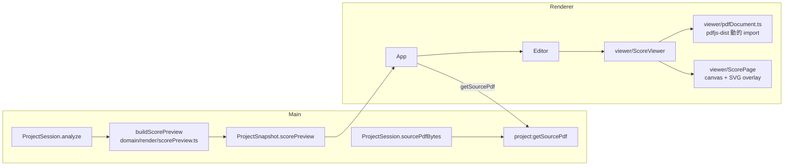

# 設計書

## アーキテクチャ概要

**「何をどこに描くか」は Main（domain）で確定させ、Renderer は PDF.js でページを描いてその上に SVG を重ねるだけ**にする。

- 注釈の表示文字列は domain（`syllableTables` / `fontMetrics`）でしか導けず、Renderer は domain を import できない
  （アーキテクチャ設計書の依存方向。ESLint で強制）。既存の `SolfaPreviewRow` と同じ理由づけ
- 座標変換（`.omr` px → pt、ページ対応）を OverlayRenderer と**同じ関数**で行うことで、「出力PDFと同じ位置」を構造で担保する
- 座標は **pt・左上原点**で渡す。SVG の `viewBox="0 0 widthPt heightPt"` にそのまま載り、SVG の `<text x y>` は
  pdf-lib の `drawText` と同じく「左端＋ベースライン」を基準にするため、注釈のアンカー定義（`Annotation.anchor`）を変換せずに使える



## コンポーネント設計

### 1. `buildScorePreview`（domain/render/scorePreview.ts・新規）

**責務**:

- 注釈・スキップ小節・配置警告を、**元PDFのページごと**に pt・左上原点の座標へ変換してまとめる
- 注釈の表示文字列・変化音かどうかを出力PDFと同じ規則で確定する

**入力 / 出力**:

```typescript
buildScorePreview(input: {
  score: ScoreModel;                     // applyDegrees 済み
  omrPages: readonly OmrPageContent[];   // stack（小節の横範囲）と譜表の縦範囲
  pages: readonly PageInfo[];
  annotations: readonly Annotation[];
  annotationIssues: readonly AnnotationIssue[];
  settings: ProjectSettings;
}): ScorePreviewPage[]
```

**実装の要点**:

- **ページのキーは `sourcePageIndex`**（元PDFのページ）。Victoria は Audiveris 4 ページ → 元PDF 3 ページで、
  sheet#1 の 2 ページ分の注釈は同じ元PDFページへ集まる。Audiveris ページをキーにすると元PDFのページが重複する
- 注釈の文字列は OverlayRenderer の `textFor` と同じ規則。**`textFor` を `domain/render/annotationContent.ts` へ切り出して両者で共有**する
  （複製すると「プレビューと出力で文字が違う」が起き得る）
- 描けない文字の置換は `solfaFonts(fontFamily).{regular|bold}.displayText` を通す（出力PDFと同じ）
- 描かないもの: `deleted`、`layer !== 'solfa'`、文字が決まらない注釈（孤立注釈）、PageInfo が無い／変換できないページ
- 座標変換は `coordinateTransform.ts` に `toPreviewPoint(page, x, y)`（pt・左上原点）を追加する。
  `toPdfPoint` と縮尺の求め方（軸ごと・`isTransformable`）を共有し、y 反転だけをしない
- **スキップ小節の矩形**: `score.systems` から小節を含む段（`firstMeasureIndex ≤ index < firstMeasureIndex + measureCount`）を引き、
  - 横: `.omr` の `stacks[index - firstMeasureIndex]` の left/right。stack が無い（`measureNotDetected`）なら段内の譜表の横範囲全体へ落とす
  - 縦: その段で `partId` が一致する譜表の譜線範囲（上端〜下端）の和集合。上下に半譜線間隔の余白を足す
  - 段・譜表の縦範囲が見つからない小節は矩形を作らない（一覧側で「位置を特定できない」行になる）
- **配置警告**: `placementUnresolved.annotationId` の注釈アンカー位置にマーカーを置く（注釈を描かない場合でも位置が分かれば置く）
- 並び: ページは `sourcePageIndex` 昇順、ページ内は入力順（決定的）

### 2. `OmrStaff` の譜線範囲（domain/score/OmrSheetParser.ts・変更）

**責務**: sheet XML の `<staff><lines><line><point x y/>` から譜表の縦範囲を読む

**実装の要点**:

- `OmrStaff` に `extent?: { top: number; bottom: number }` を追加。全 `<point>` の y の最小・最大
- 譜線が無い／読めない場合は `extent` を付けない（必須にすると既存の擬似データ・テストの全箇所に波及する。
  「情報が無い」ことを型で表せれば十分）

### 3. 編成レイヤー（main/ProjectSession.ts・ipc・preload・変更）

- `analyze()` の末尾で `buildScorePreview` を呼び、`SessionSnapshot.scorePreview` に載せる（承認時は保持値を返す＝`preview` と同じ扱い）
- `sourcePdfBytes(): Uint8Array` を追加（`require()` で未オープンを弾く）
- IPC `project:getSourcePdf` → `IpcResult<Uint8Array>`。スナップショットに入れないのは、
  **数十MBの PDF を訂正のたびに送り直さない**ため（PDF はセッション中に変わらない）
- `ProjectSnapshot`（shared）に `scorePreview: ScorePreviewPage[]` を追加。型は `shared/types/ScorePreview.ts`

### 4. PDF 読み込み（renderer/viewer/pdfDocument.ts・新規）

**責務**: pdfjs-dist を包み、画面部品が PDF.js の API に直接触れないようにする

```typescript
interface PdfDocumentHandle {
  pageSizes: { widthPt: number; heightPt: number }[]; // 回転適用後（getViewport({ scale: 1 })）
  renderPage(pageIndex: number, canvas: HTMLCanvasElement, scale: number): { promise: Promise<void>; cancel(): void };
  destroy(): void;
}
type PdfLoader = (bytes: Uint8Array) => Promise<PdfDocumentHandle>;
```

**実装の要点**:

- `pdfjs-dist` は**動的 import** する。バンドルが分割され初期表示が軽くなるうえ、jsdom の画面テストへ PDF.js を持ち込まずに済む
  （画面部品は `loadPdf` を props で差し替え可能にし、テストでは擬似ローダーを注入する）
- worker は `pdfjs-dist/build/pdf.worker.min.mjs?url` で同一オリジンのファイルとして配る（`default-src 'self'` のまま動く）
- `getDocument({ data: bytes.slice(), wasmUrl, standardFontDataUrl, useSystemFonts: true })`
  - `data` は worker へ転送されて元の配列が detach されるため、**複製を渡す**（React の再描画で再読込しても壊れない）
  - `wasmUrl`: pdfjs v6 はスキャンPDFで多い **JBIG2 / JPEG2000 のデコーダを `wasmUrl` から読む**（wasm、失敗時は同じ場所の JS 版）。
    未指定だとスキャン楽譜が描けないため必須。`new URL('pdfjs/wasm/', document.baseURI)` で同一オリジンの絶対URLにする
  - `standardFontDataUrl`: 埋め込まれていない標準フォント（タイトル等）の代替字形。同上
  - `useSystemFonts: true`: sans 系の代替字形（LiberationSans）は GPLv2 のため同梱せず、OS のフォントで代替する（実装時に変更）
- URL を渡さず `data` だけを渡すため、PDF.js がネットワークへ出る経路は使わない（セキュリティ規約）

### 5. pdfjs 資産の配布（electron.vite.config.ts・変更）

- 小さな Vite プラグイン `servePdfjsAssets()` を追加する
  - build: `pdfjs-dist/wasm/`（`jbig2*`・`openjpeg*`・`qcms_bg.wasm`・LICENSE）と `pdfjs-dist/standard_fonts/` を `out/renderer/pdfjs/` へ出力（`emitFile`）
  - serve: dev サーバで `/pdfjs/*` を同じファイルへ対応付ける
- ファイルをリポジトリへ複製しない（ライセンス表記付きの upstream をそのまま配る。更新時の追従漏れを防ぐ）
- `quickjs-eval.*`（PDF 内 JavaScript 実行用）は配らない。楽譜の表示に不要で、実行経路を増やさない
- `LiberationSans-*`（GPLv2＋フォント例外）は配らない。配布に対応ソースの提供条件が付くうえ、用途は埋め込みのない Helvetica / Arial の代替だけのため（実装時に追加した判断）

### 6. `ScoreViewer` / `ScorePage`（renderer/viewer/・新規）

**責務**: ページを縦に並べ、近くに来たページだけキャンバスへ描き、SVG で注釈・ハイライト・警告を重ねる

**実装の要点**:

- 状態は `loading` / `error` / `ready`。エラー時は「楽譜を表示できませんでした（理由）」を出し、Editor の他の区画はそのまま使える
- ページの枠は `pageSizes` の縦横比で先に確保する（描画前でもスクロール位置が安定し、ジャンプ先の位置が決まる）
- **遅延描画**: `useNearViewport`（IntersectionObserver、`rootMargin` でおおむね前後 1 ページ）。近いページだけ
  キャンバス描画と**注釈テキストの SVG 要素**を出す。IntersectionObserver が無い環境（jsdom）は全ページを近いものとして扱う
- キャンバスは `devicePixelRatio × 表示幅 / widthPt` の倍率で描き、表示サイズは CSS で枠へ合わせる。離れたら描画をキャンセルする
- スキップ小節の矩形と警告マーカーは件数が少ないため**全ページ常時**出す（ジャンプ先の要素が常に存在する）
- 注釈の書体: `font-family` は設定値（`sans-serif` 等の CSS 総称名がそのまま通る）、変化音は `font-weight="bold"`、色は設定値
- スタイルは React の `style` プロパティ（CSSOM 経由のため CSP の `style-src` に掛からない）と SVG の表示属性で付ける

### 7. Editor / App（変更）

- Editor に「楽譜プレビュー」区画を追加する（階名の表記の直後。切り替え結果がすぐ見える位置）
- 既存の文字の階名プレビューは `<details>`「先頭部分の階名を文字で見る」へ畳んで残す（PDF を表示できない場合の代替）
- 「階名が付かなかった小節」の各行を**ボタン**にし、押すと `focus` を ScoreViewer へ渡す。ScoreViewer は該当矩形を
  `scrollIntoView({ block: 'center' })` し、強調色に切り替える。位置が無い行はボタンにしない
- App は Editor へ入るとき `getSourcePdf` を呼び、**プロジェクト id ごとに 1 回だけ**取得して保持する（訂正のたびに送り直さない）。
  別プロジェクトを取り込む／開くときに破棄する

## データフロー

### プレビュー表示

```
1. 承認して Editor へ進む（または開き直す）
2. App が api.getSourcePdf() → Uint8Array を保持
3. ScoreViewer が loadPdf(bytes) → pageSizes を得て全ページの枠を並べる
4. 近いページだけ renderPage でキャンバス描画し、snapshot.scorePreview の該当ページの注釈を SVG で重ねる
5. 設定の切り替え → Main が再解析 → 新しい scorePreview が届き、SVG だけが描き変わる（PDF は再取得しない）
```

### スキップ小節へのジャンプ

```
1. 一覧の行をクリック → Editor が focus = { partId, measureIndex, seq } を更新
2. ScoreViewer が該当矩形を探して scrollIntoView し、強調表示にする
```

## エラーハンドリング戦略

- 新しいエラークラスは作らない
- `getSourcePdf` の失敗は `IpcResult` の `ok: false` で受け、ScoreViewer の区画内にメッセージを出す（画面全体は落とさない）
- PDF.js の読み込み失敗（壊れたPDF等）は ScoreViewer 内で捕捉して同じ区画に表示する（アーキテクチャ設計書「PDF.js のパース失敗を捕捉し UI エラーに変換」）
- ページ描画のキャンセル（スクロールで離れた）は失敗として扱わない。それ以外の描画失敗はそのページに「このページを表示できませんでした」を出す

## テスト戦略

### ユニットテスト

- `buildScorePreview`: 座標変換、元PDFページへの集約（2 Audiveris ページ → 1 元PDFページ）、非表示の注釈、変化音、文字の置換、
  スキップ小節の矩形（stack あり／なし／譜表範囲なし）、配置警告、PageInfo の欠落
- `annotationContent`: 手動の文字＞階名、孤立注釈
- `toPreviewPoint`: 軸ごとの縮尺・y を反転しないこと・変換不能ページ
- `OmrSheetParser`: 譜線範囲の抽出と欠落
- `ProjectSession`: スナップショットの `scorePreview`、承認後も保持、`sourcePdfBytes`
- `projectHandlers`: `getSourcePdf` の成功・未オープン時の失敗
- 画面: `ScoreViewer`（ページ数・注釈の色と太字・エラー表示・遅延描画・ジャンプ）、`Editor`（一覧のボタン化・位置不明の行）、
  `App`（Editor 入場時に 1 回だけ取得・失敗表示）

### 統合テスト

- 実データ Victoria / divisi でプレビューを構築し、注釈数が出力PDFの `drawnCount` と一致すること、
  スキップ小節がすべて位置を持つこと（または位置を持たない件数）、元PDFページ数を超えないことを固定する
- divisi の構築が 1 秒未満（性能要件）

## 依存ライブラリ

```json
{
  "devDependencies": {
    "pdfjs-dist": "^6.3.289"
  }
}
```

- **devDependencies に置く**。Renderer のバンドルに取り込まれるため実行時に `node_modules` は不要で、
  `dependencies` にすると electron-builder が optional の `@napi-rs/canvas`（Node 用ネイティブアドオン）まで asar へ同梱してしまう
- ライセンス: pdf.js は Apache-2.0。配る資産に JBIG2（PDFium 由来・BSD-3）、OpenJPEG（BSD-2）、qcms（MIT）、
  Foxit フォント（BSD-3）を含むため `THIRD_PARTY_LICENSES.md` に追記する（Liberation フォントは GPLv2 のため同梱しない）

## ディレクトリ構造

```
src/
├── domain/render/
│   ├── annotationContent.ts      # 新規: 注釈の表示文字列（OverlayRenderer から切り出し）
│   ├── scorePreview.ts           # 新規: プレビュー用データの構築
│   ├── coordinateTransform.ts    # 変更: toPreviewPoint
│   └── OverlayRenderer.ts        # 変更: annotationContent を使う
├── domain/score/OmrSheetParser.ts  # 変更: OmrStaff.extent
├── shared/types/ScorePreview.ts  # 新規
├── shared/ipc/{channels,contract}.ts
├── main/{ProjectSession.ts, ipc/projectHandlers.ts, index.ts}
├── preload/{api.ts, index.ts}
└── renderer/
    ├── vite-env.d.ts             # 新規: `?url` import の型
    ├── viewer/
    │   ├── pdfDocument.ts        # 新規
    │   ├── useNearViewport.ts    # 新規
    │   ├── ScoreViewer.tsx       # 新規
    │   └── ScorePage.tsx         # 新規
    ├── screens/Editor/Editor.tsx
    └── App.tsx
tests/
├── unit/domain/render/{scorePreview,annotationContent}.test.ts
├── integration/pipeline/score-preview.test.ts
└── unit/renderer/ScoreViewer.test.tsx
```

## 実装の順序

1. domain（型 → 譜線範囲 → 座標変換 → 文字列の共有 → buildScorePreview）とテスト
2. 編成レイヤー（ProjectSession・IPC・preload）とテスト
3. 統合テスト（実データ）
4. pdfjs 導入（Vite プラグイン・ローダー）
5. 画面（ScoreViewer・Editor・App）とテスト
6. 品質チェック・ドキュメント・ライセンス表記

## セキュリティ考慮事項

- CSP（`index.html` の `default-src 'self'`）は変更しない。worker・wasm・フォントはすべて同一オリジンのファイルとして配る
- PDF.js には `data` だけを渡し、URL 読み込み・PDF 内 JavaScript（quickjs）は使わない
- IPC で公開するのは「開いているプロジェクトの元PDFのバイト列を返す」だけ。パスを受け取らない（任意ファイルの読み出し口にしない）

## パフォーマンス考慮事項

- プレビューデータは Main で 1 回の走査（音符 id 索引・ページ索引）で組み立てる。divisi で 1 秒未満をテストで固定
- Renderer はキャンバスと注釈テキストを表示中ページ付近に限定する（DOM 要素数を全音符数に比例させない）
- 元PDFはプロジェクトごとに 1 回だけ IPC で送る

## 将来の拡張性

- #5（注釈編集）: `ScorePreviewAnnotation.id` が注釈 id なので、SVG 要素のクリックから編集対象を引ける
- #6（転調点）: `ScorePreviewPage` に転調点マーカーの配列を足すだけで、同じ SVG レイヤーに描ける
