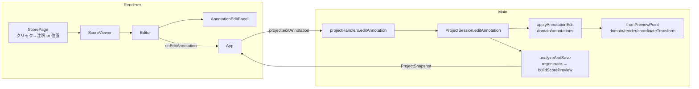

# 設計書

## アーキテクチャ概要

#4 の方針「**何をどこに描くかは Main（domain）で確定させ、Renderer は SVG に載せるだけ**」をそのまま編集にも延ばす。

- Renderer は「どの注釈を」「どの位置（プレビュー座標 = pt・左上原点・**元PDFのページ**）に」「どういう文字で」
  という**ユーザーの意図**だけを 1 つの IPC（`project:editAnnotation`）で送る
- Main は domain の純関数 `applyAnnotationEdit` で注釈列を更新し、**解析を流し直して**（`analyzeAndSave`）スナップショットを返す。
  注釈の配置（手動注釈を障害物として自動注釈が避ける）・プレビュー・出力PDF・再読み込み後の結果が、すべて同じ経路
  （`regenerateAnnotations` → `buildScorePreview` / `renderOverlay`）で決まるため、「画面では見えたのに出力・再読み込みで変わる」が起きない
- プレビュー座標 → `.omr` px の逆変換（`fromPreviewPoint`）は `coordinateTransform` に置き、`toPreviewPoint` と縮尺の求め方を共有する



## コンポーネント設計

### 1. `AnnotationEdit`（shared/types/Annotation.ts・追加）

```typescript
export type AnnotationEdit =
  /** 楽譜上の位置に階名を書き足す。座標はプレビュー座標（pt・左上原点）で、文字の中心にあたる */
  | { kind: 'add'; sourcePageIndex: number; x: number; y: number; text: string }
  /** 文字を書き換える。null は自動の階名に戻す（自動注釈のみ） */
  | { kind: 'setText'; id: string; text: string | null }
  /** 削除する（自動注釈は deleted を立てる・手動注釈は取り除く） */
  | { kind: 'remove'; id: string }
  /** 直前の削除を取り消す。削除前の注釈をそのまま渡す */
  | { kind: 'restore'; annotation: Annotation };
```

- Renderer は `.omr` の座標系も Audiveris ページも知らない（知らせない）。**元PDFページ＋pt** で送り、Main が逆変換する
- `restore` に削除前の注釈を丸ごと渡すのは、手動注釈は削除で実体が消えるため（id だけでは戻せない）

### 2. `applyAnnotationEdit`（domain/annotations/AnnotationManager.ts・追加）

**責務**: 注釈列に編集を 1 件適用した新しい配列を返す（純関数）。

```typescript
applyAnnotationEdit(
  annotations: readonly Annotation[],
  edit: AnnotationEdit,
  context: { pages: readonly PageInfo[]; settings: ProjectSettings; newId: () => string },
): Annotation[]
```

**実装の要点**:

- 文字は前後の空白を落とす。空文字・上限（`MANUAL_TEXT_MAX_LENGTH` = 16）超過は `AnnotationEditError`
- `add`: `manualAnchorAt` で位置を決め、`addAnnotation` で手動注釈を作る
- `setText`: 手動注釈に null（＝自動に戻す）は不正。存在しない id・削除済みの注釈も不正
- `remove`: 既存の `removeAnnotation`
- `restore`: 同じ id があれば `deleted: false` に戻す（自動注釈）。なければ手動注釈として末尾に戻す。自動注釈で実体が無いものは不正
- 不正な編集は `AnnotationEditError`（domain/annotations/errors.ts・新規）を投げる。IPC では `unexpected` として文言を表示する
  （Renderer 側で入力を制限しているため、ここへ来るのは食い違いのみ）

### 3. `manualAnchorAt`（同上）

**責務**: 押した位置（プレビュー座標・元PDFページ）から手動注釈の `anchor`（`.omr` px・左端＋ベースライン）を決める。

- 元PDFページ → Audiveris ページは、`sourcePageIndex` が一致する `PageInfo` のうち**最小の `pageIndex`**。
  同じ sheet の Audiveris ページは画像座標系を共有する（`PageInfo.omrImage*` のコメント）ため、どれを選んでも描画位置は同じ
- 押した点が**文字の中心**になるよう、幅の半分だけ左、アセンダの半分だけ下をベースラインにする
  （`anchor` は左端＋ベースライン。押した点を左端にすると、書いた文字が右へずれて見える）
- 寸法は自動注釈と同じ `solfaFonts(fontFamily).regular` とフォントサイズ（pt → px は `pxPerPt`）で求める
- 対応するページが無い・変換できないページなら `AnnotationEditError`

### 4. `fromPreviewPoint`（domain/render/coordinateTransform.ts・追加）

`toPreviewPoint` の逆（pt・左上原点 → `.omr` px）。縮尺は同じ式から求める。変換できないページは null。

### 5. `ScorePreviewAnnotation` の拡張（shared/types/ScorePreview.ts）

- `origin: 'auto' | 'manual'` と `textOverridden: boolean` を足す。編集パネルが
  「自動の階名に戻す」を出すか・削除の説明を出し分けるのに使う
- `buildScorePreview` で `annotation.origin` と `annotation.origin === 'auto' && annotation.text !== null` を詰める

### 6. `ProjectSession.editAnnotation`（main/ProjectSession.ts）

- `applyAnnotationEdit` → `analyzeAndSave`。承認（`completedAt`）は無効化しない
  （注釈の編集は「音部記号・調の確認」の対象を変えないため。`setSettings` と同じ扱い）
- `unmatchedCorrections` は変えない（訂正ではないため）
- 手動注釈の id は `manual-<UUID>`（`node:crypto` の `randomUUID`）。テストのためコンストラクタで差し替え可能にする

### 7. IPC（shared/ipc・preload・main/ipc/projectHandlers・main/index）

- `project:editAnnotation`: `(edit: AnnotationEdit) => IpcResult<ProjectSnapshot>`

### 8. `ScorePage` / `ScoreViewer`（renderer/viewer）

- SVG を**重ねるものが無いページにも常に置く**（viewBox は PDF.js のページ寸法）。階名が 1 つも無いページにも書き足せるように
- `onPick` が渡されたときだけ編集可能。SVG の `onClick` 1 か所で受ける（注釈は 1 ページ数百あり、要素ごとにハンドラを付けない）
  - 押した要素が `data-annotation` を持てば（階名の文字・警告の印）その注釈を選ぶ
  - それ以外は `getBoundingClientRect` からページの pt 座標を求めて「位置」として渡す
- 選択中の注釈は下線＋太めの縁取りで示し、書き足す位置は十字の印で示す
- 編集可能なときはカーソルを十字にし、階名の文字はポインタにする

### 9. `AnnotationEditPanel`（renderer/screens/Editor・新規）

- 画面下端に固定した小さなフォーム（プレビューは縦に長く、区画の頭に置くと見えない）
- 既存の階名: 文字の入力・「書き換える」「削除」「自動の階名に戻す」（上書き済みの自動注釈のみ）「閉じる」
- 新しい位置: 文字の入力・「書き足す」「閉じる」
- 削除直後: 「階名「do」を削除しました」と「元に戻す」
- 入力は半角英数字を案内する（標準フォントで描けない文字は `?` になるため）。空のときは確定ボタンを無効化
- `busy` の間は操作できない

### 10. `Editor`（renderer/screens/Editor/Editor.tsx）

- **区画の並び（#17）**: 概要 → 階名が付かなかった小節 → 配置警告 → 孤立注釈 → ページの問題 → 適用されなかった訂正 →
  PDF出力 → 確認画面へ戻る → 階名の表記 → 楽譜プレビュー（最後）
  - 「階名の表記」は切り替えた結果がすぐ下で見えるよう、引き続きプレビューの直前に置く
  - 「確認画面へ戻る」はプレビューより上（プレビューの後ろに置くと数十ページ分スクロールしないと届かない）
- h1 直下の案内文に、楽譜上で階名を直せることを加える
- 選択（注釈 or 位置）と直前に削除した注釈を state で持ち、パネルの操作を `onEditAnnotation` へ流す
- 楽譜プレビュー区画に操作説明を 1 文置く

### 11. `App`

- `editAnnotation(edit)`: `api.editAnnotation` → `accept`。成功したら出力結果の表示を消す（`changeSettings` と同じ理由）

## データフロー

### 階名を書き足す

```
1. ユーザーが楽譜上の空いた位置（スキップ小節の枠の中など）を押す
2. ScorePage が pt 座標を求め、Editor が「新しい位置」を選択し、十字の印とパネルを出す
3. 文字を入力して「書き足す」→ onEditAnnotation({kind:'add', sourcePageIndex, x, y, text})
4. Main: manualAnchorAt で .omr px の anchor を決め、手動注釈を追加 → 解析し直し → 自動保存を予約
5. 新しいスナップショットの scorePreview に手動注釈が載り、画面に出る。出力PDFにも同じ位置で描かれる
```

### 削除と取り消し

```
1. 階名を押して選び、「削除」→ onEditAnnotation({kind:'remove', id})
2. Editor は削除前の Annotation（project.annotations から引く）を控え、パネルに「元に戻す」を出す
3. 「元に戻す」→ onEditAnnotation({kind:'restore', annotation})
```

## エラーハンドリング戦略

### カスタムエラークラス

- `AnnotationEditError`（domain/annotations/errors.ts）: 適用できない編集（存在しない id・空文字・ページ対応なし等）

### エラーハンドリングパターン

- Main: `toIpcError` の既定分岐（`unexpected`）で文言を返す
- Renderer: App の `withError` で画面上部に出す（既存の訂正系と同じ）。スナップショットは更新しない

## テスト戦略

### ユニットテスト

- `coordinateTransform.fromPreviewPoint`: `toPreviewPoint` との往復・変換できないページ
- `applyAnnotationEdit` / `manualAnchorAt`: 各 kind の正常系、中心合わせ、最小 pageIndex の選択、不正な編集
- `buildScorePreview`: `origin` / `textOverridden` を詰める
- `ProjectSession.editAnnotation`: 追加がプレビューに載る・承認を無効化しない・自動保存・
  再解析（`setSettings`）後も手動注釈・削除・上書きが残る・保存→再読み込みで復元
- `projectHandlers.editAnnotation`: 成功と失敗の `IpcResult`
- `ScoreViewer`（ScorePage）: 階名を押すと注釈、空いた位置を押すと pt 座標が渡る・重ねるものが無いページにも書き足せる
- `Editor`: 区画の並び（プレビューが最後・一覧と出力が上）、パネルの各操作が正しい `AnnotationEdit` を渡す、削除の取り消し
- `App`: 編集結果のスナップショット反映・出力結果の破棄

### 統合テスト

- `export/reopen-and-export`（または新規）: 手動注釈の追加・自動注釈の削除をしたプロジェクトを保存→再読み込み→出力し、描画件数に反映される

## 依存ライブラリ

追加なし。

## ディレクトリ構造

```
src/shared/types/Annotation.ts              # AnnotationEdit 追加
src/shared/types/ScorePreview.ts            # origin / textOverridden 追加
src/shared/ipc/channels.ts, contract.ts     # project:editAnnotation
src/domain/annotations/errors.ts            # 新規 AnnotationEditError
src/domain/annotations/AnnotationManager.ts # applyAnnotationEdit / manualAnchorAt
src/domain/render/coordinateTransform.ts    # fromPreviewPoint
src/domain/render/scorePreview.ts           # origin / textOverridden
src/main/ProjectSession.ts                  # editAnnotation
src/main/ipc/projectHandlers.ts, index.ts   # ハンドラ登録
src/preload/api.ts, index.ts                # editAnnotation
src/renderer/viewer/ScorePage.tsx, ScoreViewer.tsx
src/renderer/screens/Editor/Editor.tsx
src/renderer/screens/Editor/AnnotationEditPanel.tsx  # 新規
src/renderer/App.tsx
```

## 実装の順序

1. #17 の区画並び替え（テスト更新込み）
2. 型・逆変換・domain の編集関数（テスト込み）
3. プレビューの拡張・セッション・IPC（テスト込み）
4. Renderer（ビューア → パネル → Editor → App）（テスト込み）
5. 統合テスト・ドキュメント

## セキュリティ考慮事項

- 新しい IPC はパスを受け取らず、開いているプロジェクトの注釈列だけを書き換える
- 楽譜由来データの外部送信なし。CSP を緩めない（スタイルは React の `style` プロパティのみ）

## パフォーマンス考慮事項

- 編集 1 回ごとに解析を流し直す（実測で 1 曲数百 ms。訂正・表記切り替えと同じ）。
  自動保存は既存の 300ms デバウンス
- クリックは SVG 1 か所で受ける（注釈要素ごとにハンドラを付けない）

## 将来の拡張性

- ドラッグ移動は `AnnotationEdit` に `move` を足せば同じ経路に載る
- 手動注釈の変化音指定は `Annotation` にフィールドを足す必要がある（スキーマ変更）ため別 Issue とする
