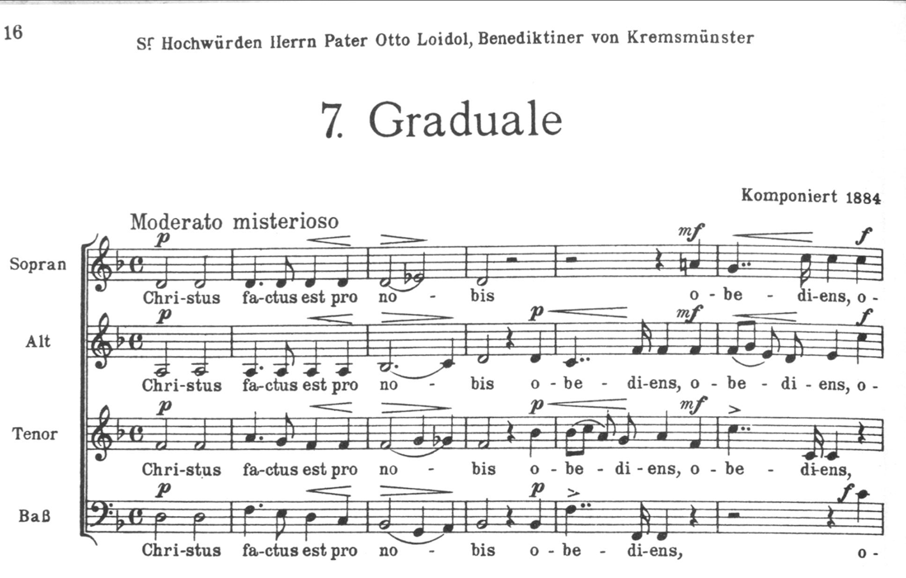
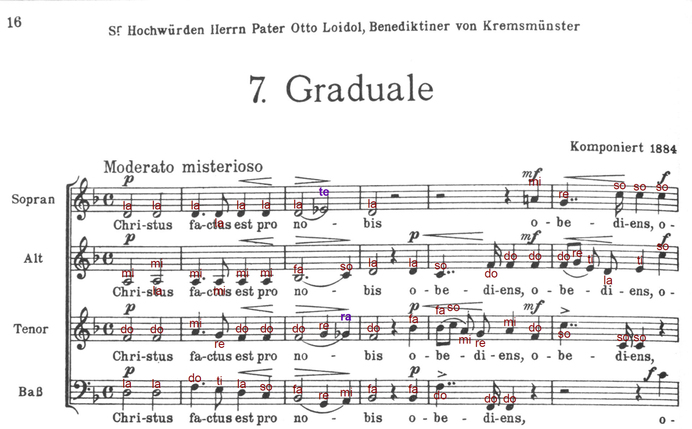

# Solfa Overlay

合唱楽譜のスキャンPDFを読み込むと、**全音符に移動ドの階名を書き込んだ印刷用のPDF**を出力するデスクトップアプリです。楽譜を組み直さないので、練習で使う版面（ページ割・段の区切り・練習番号）はそのまま保たれます。

<p align="center">
  
</p>
<p align="center"><em>取り込む楽譜（スキャンPDF）</em></p>

<p align="center">
  
</p>
<p align="center"><em>出力されるPDF。全パートの音符に階名が付き、変化音（<code>te</code> / <code>ra</code> など）は色を変えて表示されます</em></p>

<p align="center"><sub>掲載譜例: Anton Bruckner《Christus factus est》WAB 11（1884年作曲／作曲者1896年没）<a href="https://imslp.org/wiki/Christus_factus_est%2C_WAB_11_(Bruckner%2C_Anton)">IMSLP #365527</a>・パブリックドメイン</sub></p>

## できること

- **版面を変えずに階名を重ねる** — 楽譜を再組版しないため、練習現場で「みんなと同じ版・同じページ・同じ練習番号」を保てます
- **全音符に移動ドの階名を自動付与** — 調号から階名を解き明かして書き込む機械的な作業（1曲あたり十数分〜数十分）を自動化します。短調は La 基準（コダーイ式音節）
- **完全ローカル処理** — 楽譜データを外部サーバーへ一切送信しません。OMR（楽譜認識）エンジンもアプリに同梱されているため、インターネット接続なしで動作します

## 動作要件

| 項目 | 要件 |
| --- | --- |
| OS | Windows 10 / 11（64bit） |
| インストーラのサイズ | 約 153MB |
| インストール後のディスク使用量 | 約 506MB |
| 管理者権限 | 不要（ユーザー単位でインストールされます） |
| 別途インストールが必要なもの | **なし**（OMR エンジン Audiveris と Java ランタイムを同梱しています） |

> macOS / Linux 版は現在提供していません。

## インストール

1. [Releases](https://github.com/ntnamazu/solfa-overlay/releases/latest) から最新版のインストーラ（`.exe`）をダウンロードします。
2. ダウンロードした `.exe` を実行します。
3. 画面の指示に従ってインストールします（インストール先は変更できます）。

### SmartScreen の警告が出た場合

本アプリは**コード署名をしていません**（自分＋合唱仲間で使う小規模配布のため。署名証明書は有料かつ個人での取得ハードルが高く、規模が要求してから検討する方針です）。

そのため、ダウンロードした `.exe` を初めて実行すると **Microsoft Defender SmartScreen** が全画面の警告を表示します。

- 表示される文言: **「Windows によって PC が保護されました」／「発行元: 不明な発行元」**
- これは**ウイルスを検出したという意味ではありません**。まだ実績（評判）のない新しいアプリに対する保護で、ダウンロードしたファイルに付く識別情報（Mark of the Web）をきっかけに表示されます。**ダウンロードした未署名アプリでは、この警告が出るのが正常な状態**です。

**実行する手順:**

1. 警告画面の **「詳細情報」** をクリックします。
2. 表示された **「実行」** ボタンをクリックします。

> 📌 **警告画面の色について**: この画面は青で紹介されることが多いですが、**背景色は Windows の「アクセントカラー」設定に追従する**ため、赤系など別の色で表示されることがあります（本プロジェクトで実機確認済み）。色が違っても、上記の文言であれば同じ「未知のアプリに対する保護」です。

> ⚠️ 上記は「信頼できる入手経路から取得した」ことが前提の手順です。本リポジトリの Releases 以外から入手した `.exe` は実行しないでください。判断根拠と、将来コード署名を導入する場合の選択肢は [`docs/ideas/audiveris-bundling-license.md`](docs/ideas/audiveris-bundling-license.md)「5.5 コード署名の実務メモ」にまとめてあります。

## 使い方

1. **楽譜を取り込む** — 「PDFを取り込む」から、スキャンした楽譜のPDFを選びます（保存済みの作業を再開する場合は「プロジェクトを開く」）。
2. **認識を待つ** — 同梱の Audiveris が楽譜を読み取ります。ページ数に応じて時間がかかります。
3. **譜表構造を確認する** — ページと段の対応が正しいかを確認します。
4. **音部記号と調を確認する** — OMR が誤読しやすい音部記号（ト音・ヘ音・ハ音）と調を訂正します。**ここでの訂正が階名の正確さを最も左右します**。長調／短調の指定もここで行います。
5. **階名を確認して書き出す** — 付与された階名を確認し、「PDFに書き出す」で階名入りのPDFを出力します。

作業の途中経過はプロジェクトファイル（`.solfaproj`）として保存でき、あとから再開できます。

## 実装状況

- [x] プロジェクト基盤（TypeScript strict / ESLint レイヤー境界 / Vitest / CI）
- [x] Electron シェル（ハードニング済み Main + 型付きIPC + React Renderer）
- [x] SolfaEngine（階名計算コア: 度数＋変位の内部表現、コダーイ式 / Tonic sol-fa 略記の文字列化）
- [x] ScoreModelBuilder（MusicXML × `.omr` 照合コア: 小節照合・音高クロスチェック）
- [x] OmrRunner（Audiveris 統合: ヘッドレス実行・zip 展開。実楽譜フィクスチャで回帰）
- [x] 確認画面（譜表構造の確認 / 音部記号と調の確認）
- [x] 階名の付与と PDF 出力（元の版面に重ね書き）
- [x] 配布ビルド基盤（Audiveris 同梱: `fetch-resources` / Windows 未署名 `.exe`: electron-builder / `release.yml`）
- [ ] **注釈の手動編集と、元PDFへの重ね表示によるプレビュー**（現在は階名をテキストの一覧で確認する形式です）
- [ ] **階名表記の切り替えUI**（現在はコダーイ式に固定。Tonic sol-fa 略記は内部的には対応済みですが、画面から選べません）

> 現在のバージョンは `0.1.0` です。取り込みから出力までは一通り動作しますが、UI には改善の余地があります。使ってみた感想や不具合の報告を [Issues](https://github.com/ntnamazu/solfa-overlay/issues) でお寄せいただけると助かります。

## 楽譜の著作権について

本アプリは、**利用者が適法に入手した楽譜を、私的使用の範囲で利用すること**を想定しています。出力したPDFを第三者へ配布・共有する場合は、その楽譜の権利者が認める範囲に従ってください。

なお本アプリは設計上、楽譜データを外部サーバーへ送信・保存しません（すべてローカルで処理されます）。

## ライセンス

- **アプリ本体**: [MIT License](LICENSE)
- **同梱コンポーネント**: 配布版には OMR エンジン **Audiveris**（AGPL-3.0）と Java ランタイム（GPLv2 + Classpath Exception）を同梱しています。各コンポーネントのライセンス・入手元・対応ソースの提供方法は [THIRD_PARTY_LICENSES.md](THIRD_PARTY_LICENSES.md) を参照してください。

> ⚠️ 本体が MIT であることは、**同梱物のライセンス条件を緩めるものではありません**。インストーラを再配布する場合、同梱された Audiveris 部分については AGPL-3.0 の条件に従う必要があります。

---

# 開発者向け情報

## 技術スタック

Electron + TypeScript + React。詳細・選定理由は [docs/architecture.md](docs/architecture.md) を参照してください。

## 開発環境セットアップ

必要ツール: Node.js v20 以降（devcontainer 利用時は設定済み）

```bash
# 依存関係のインストール（lockfile に従う）
npm ci

# 開発モードで起動
npm run dev

# テスト実行
npm run test           # ユニット（＋統合）テスト
npm run test:coverage  # カバレッジ付き

# 静的チェック
npm run lint
npm run typecheck

# プロダクションビルド（out/ に main / preload / renderer を生成）
npm run build
```

詳細は [開発ガイドライン](docs/development-guidelines.md) を参照してください。

### OMR エンジン（Audiveris）の用意

開発時に PDF 取り込み（OMR）を動かすには、実行時に **Audiveris**（同梱 JRE でヘッドレス実行）が必要です。未用意のまま取り込むと「Audiveris が見つかりません」という案内が表示されます。次の 2 通りのどちらかで用意してください（どちらも効果は同じです）。

**ルートA: 自前で調達する（基本）**

1. [Audiveris](https://github.com/Audiveris/audiveris/releases) をインストールする（本プロジェクトは **5.6.1** で検証済み。テストフィクスチャも同版）。
2. 実行ファイルを PATH に通す（コマンド名 `audiveris` で起動できる状態にする）か、環境変数 `SOLFA_AUDIVERIS_PATH` に実行ファイルの絶対パスを設定する。

   ```bash
   # 例: PATH を通さず場所だけ指定する場合
   export SOLFA_AUDIVERIS_PATH=/opt/audiveris/bin/Audiveris
   npm run dev
   ```

**ルートB: Dev Container を使う（手軽に試す）**

- `.devcontainer` で開く／リビルドすると、Audiveris 5.6.1（＋同梱 JRE21）が同梱された状態でコンテナが起動します。追加のインストールや `SOLFA_AUDIVERIS_PATH` の設定は不要で、そのまま `npm run dev` で OMR まで動きます。
- 既に起動中のコンテナに後から反映する場合は、VS Code の「Dev Containers: Rebuild Container」でイメージを再ビルドしてください。

> どちらの経路も最終的に「`audiveris` が実行できる状態」を作るための手段です。配布版アプリでは Audiveris を同梱するため、この用意は不要です（開発時のみの手順）。

## 配布版のビルド（Windows）

Audiveris（＋同梱 JRE）を同梱した **Windows 用インストーラ（`.exe`）** を生成できます。**ビルドは Windows 実機で行ってください**（MSI の展開と NSIS インストーラ生成に Windows が必要なため。macOS/Linux 向けビルドは現状スコープ外です）。

```powershell
# 1. 依存インストール（lockfile に従う）
npm ci

# 2. 同梱 Audiveris を用意（MSI をダウンロード→SHA-256 検証→resources/audiveris/win/ へ展開）
npm run fetch-resources

# 3. Windows インストーラを生成（electron-vite build → electron-builder --win）
npm run dist:win
# → dist/ に未署名の .exe（NSIS インストーラ）が生成されます
```

- 取得する Audiveris は **5.6.1 に固定**（URL・SHA-256 を `scripts/fetch-resources.ts` に固定）。テストフィクスチャと同版です。
- 同梱物のライセンス表記は [THIRD_PARTY_LICENSES.md](THIRD_PARTY_LICENSES.md) を参照してください。インストーラにも同梱されます。

### リリース手順

バージョン番号の出どころは **`package.json` の `version` ただ 1 つ**です。アプリ画面の「バージョン: x.y.z」表示（`app.getVersion()` 経由）・インストーラのファイル名（`Solfa Overlay Setup x.y.z.exe`）・exe のファイルプロパティは、すべてこの値から生成されます。**タグを打つ前に `package.json` を上げてください。**

`npm version` を使うと、`package.json` / `package-lock.json` の更新・コミット・`v` 付きタグの作成までが一括で行われます。

```bash
npm version patch        # 0.1.0 → 0.1.1（minor / major も可）
                         # → package.json 更新 + コミット + タグ v0.1.1 を生成
git push --follow-tags   # コミットとタグをまとめて push
```

`v` から始まるタグを push すると、GitHub Actions（[`release.yml`](.github/workflows/release.yml)）が Windows ランナーでインストーラをビルドし、**下書き状態の** GitHub Release に添付します。リリースノートを整えてから公開してください。

タグ名と `package.json` の `version` が食い違っている場合、ワークフローは**ビルドを始める前に失敗します**（バージョン表記のズレた配布物を作らないためのガード）。失敗したら `package.json` を直し、タグを打ち直してください。

## ドキュメント

| ドキュメント                                         | 内容                                         |
| ---------------------------------------------------- | -------------------------------------------- |
| [プロダクト要求定義書](docs/product-requirements.md) | 何を作るか・成功指標                         |
| [機能設計書](docs/functional-design.md)              | データモデル・コンポーネント・アルゴリズム   |
| [アーキテクチャ設計書](docs/architecture.md)         | 技術スタック（正）・レイヤー構成・永続化戦略 |
| [リポジトリ構造定義書](docs/repository-structure.md) | ディレクトリ構造・命名規則・依存ルール       |
| [開発ガイドライン](docs/development-guidelines.md)   | コーディング規約・Git運用・テスト戦略        |
| [用語集](docs/glossary.md)                           | ドメイン用語と英語表記の対応                 |
