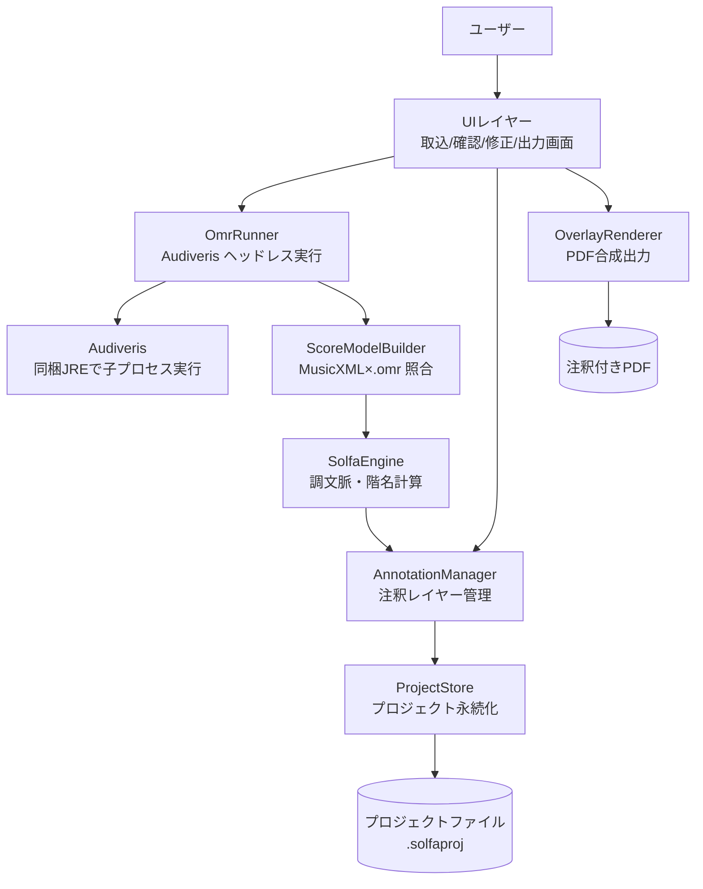
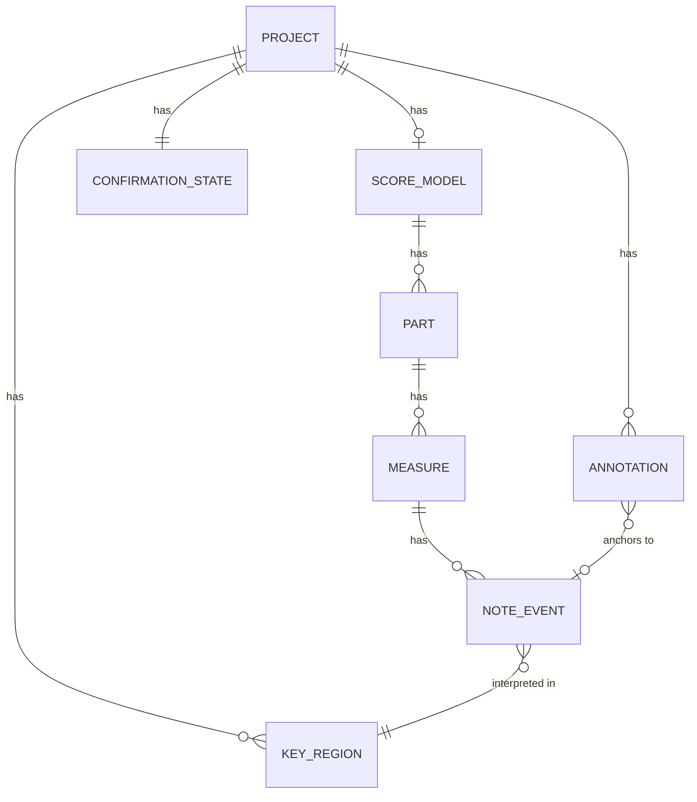
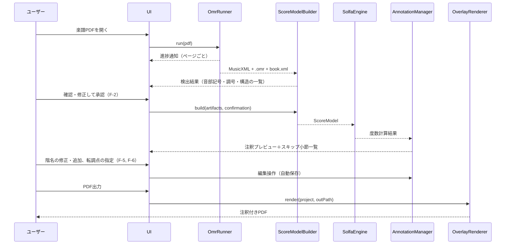
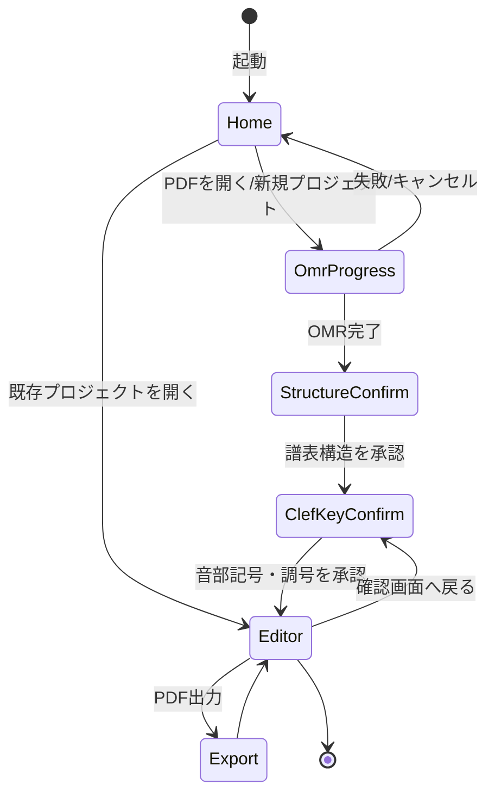

# 機能設計書 (Functional Design Document)

- 作成日: 2026-07-13
- 対応PRD: [docs/product-requirements.md](product-requirements.md)
- 対象範囲: v1（MVP: F-1〜F-5、P1: F-6）。v2の和音役割レイヤー（F-7）は拡張点のみ記載

## システム構成図

デスクトップアプリケーション（ローカル完結）。楽譜データはすべてローカルのプロジェクトファイル内で処理され、ネットワーク送信は行わない。



## 技術スタック

| 分類 | 技術 | 選定理由 |
|------|------|----------|
| アプリ形態 | デスクトップアプリ（Electron） | OMR（Audiveris＝Java）をWASM化するのは非現実的。子プロセス実行と同梱配布ができ、ローカル完結要件（PRD セキュリティ要件）を満たす |
| 言語 | TypeScript | UI・解析・出力を単一言語で実装し配布を単純化。プロトタイプの解析部はPython標準ライブラリのみ＝外部ライブラリ非依存のロジックであり、TypeScriptへの移植コストが低い |
| OMR | Audiveris（同梱JREでヘッドレス実行） | プロトタイプで検証済み（`GDK_SCALE=1`、`-Djava.awt.headless=true`）。MusicXMLと.omrの2出力が本設計の前提 |
| 画面上の楽譜表示 | PDF.js | 元PDFのページ画像化と注釈オーバーレイ表示（修正UI） |
| PDF出力 | pdf-lib | 元PDFを再エンコードせずページに描画を追加できる |
| 楽譜解析 | 自前実装（MusicXML/.omr パーサ＋階名計算） | v1に必要な解析は自前で足りることをプロトタイプで実証済み。music21（Python）はv2の和音解析で導入を再検討 |
| テスト | Vitest ＋ Playwright | ユニット／E2E |

## データモデル定義

### 設計原則

- 階名の内部表現は**「スケール度数＋変位」**で持ち、表示時に文字列化する。音節体系（コダーイ式/Tonic sol-fa略記）と短調基準（La/Do）の2軸は直交し、いつでも切替再表示できる
- **座標系は2本立て**: 解析は MusicXML の論理構造、描画位置は .omr のピクセル座標（300dpi基準）。ページのポイント座標へは線形スケールで変換する
- **注釈レイヤーは楽譜認識結果から分離**して永続化する。OMR再実行やユーザー修正で認識結果が変わっても、手動注釈と転調指定が生き残る設計とする

### エンティティ定義

```typescript
/** プロジェクト全体（プロジェクトファイルのルート） */
interface Project {
  id: string;                    // UUID
  sourcePdf: string;             // プロジェクト内に取り込んだ元PDFの相対パス
  pages: PageInfo[];             // ページごとの画像サイズ・スケール係数
  score: ScoreModel | null;      // OMR＋照合の結果（OMR未実行ならnull）
  confirmation: ConfirmationState; // 音部記号・調号の確認状態
  keyRegions: KeyRegion[];       // 調文脈（自動検出＋ユーザー指定の転調点）
  annotations: Annotation[];     // 注釈レイヤー（自動生成＋手動）
  settings: ProjectSettings;
  createdAt: string;             // ISO 8601
  updatedAt: string;
}

interface PageInfo {
  pageIndex: number;             // 0始まり
  widthPt: number;               // PDFポイント
  heightPt: number;
  omrImageWidthPx: number;       // .omr の座標基準（300dpi画像）
  omrImageHeightPx: number;      // ポイント座標へは線形スケールで変換
}

/** 認識済み楽譜の論理＋物理モデル */
interface ScoreModel {
  parts: Part[];                 // 例: Soprano/Alto/Tenor/Bass
  systems: SystemInfo[];         // ページ内の段。誤分割の統合結果を反映
  measures: Measure[];           // パート×小節
}

interface Part {
  id: string;                    // MusicXML part id（= book.xml logical-id）
  name: string;
  staves: StaffRef[];            // 譜表→パート対応（sheet XML の part id で解決）
}

interface Measure {
  partId: string;
  index: number;                 // 曲頭からの通し小節番号
  status: 'matched' | 'skipped'; // 照合結果。skipped は修正UIの対象
  notes: NoteEvent[];
}

/** 照合済みの音符1つ（MusicXMLの音楽情報＋.omrの座標） */
interface NoteEvent {
  id: string;
  partId: string;
  measureIndex: number;
  pitch: Pitch;                  // MusicXML由来
  head: PageAnchor;              // .omr由来の符頭座標（300dpi px）
  solfa: SolfaDegree | null;     // 計算結果。休符等はnull
}

interface Pitch {
  step: 'A'|'B'|'C'|'D'|'E'|'F'|'G';
  alter: number;                 // -2〜+2（記譜上の変位。調号込みの実音）
  octave: number;
}

interface PageAnchor {
  pageIndex: number;
  x: number;                     // .omr 300dpi画像ピクセル
  y: number;
}

/** 階名の内部表現（表示文字列はSolfaEngineが導出） */
interface SolfaDegree {
  degree: 1|2|3|4|5|6|7;         // 現在の「do」を1とするダイアトニック度数
  alteration: -1|0|1;            // ダイアトニック音からの半音変位
}

/** 調文脈。転調点で区切られた区間ごとに1つ */
interface KeyRegion {
  id: string;
  start: ScorePosition;          // この調が始まる位置
  tonicStep: Pitch['step'];      // 主音
  tonicAlter: number;
  mode: 'major' | 'minor';
  source: 'auto' | 'user';       // 自動検出（調号変更）かユーザー指定か
}

interface ScorePosition {
  measureIndex: number;
  offset: number;                // 小節内オフセット（divisions基準）。小節頭は0
}

/** 音部記号・調号の確認画面（F-2）の状態 */
interface ConfirmationState {
  items: ConfirmationItem[];
  completedAt: string | null;    // 未完了なら階名生成に進めない
}

interface ConfirmationItem {
  id: string;
  kind: 'clef' | 'keySignature' | 'systemStructure';
  staffRef: StaffRef;
  detected: string;              // 検出値（例: 'G-clef-8vb', '1 sharp'）
  corrected: string | null;      // ユーザー修正値。nullなら検出値を採用
  clipRect: PageAnchor & { width: number; height: number }; // 元画像の切り抜き範囲
}

interface StaffRef {
  pageIndex: number;
  systemIndex: number;
  staffIndex: number;
  partId: string | null;
}

/** 注釈（出力PDFに描画される単位） */
interface Annotation {
  id: string;
  layer: 'solfa' | 'chordRole';  // chordRole は v2
  anchor: PageAnchor;            // 描画位置（衝突回避で調整後の位置）
  noteId: string | null;         // 自動生成注釈は元音符を参照。手動追加はnull
  text: string | null;           // 手動上書き文字列。nullなら solfa から導出
  origin: 'auto' | 'manual';
  deleted: boolean;              // 自動生成注釈の非表示化（再生成で復活させない）
}

/** 設定（PRD F-3の決定事項） */
interface ProjectSettings {
  syllableSystem: 'kodaly' | 'tonicSolfa'; // デフォルト: 'kodaly'
  minorBasis: 'la' | 'do';                 // デフォルト: 'la'
  diatonicColor: string;         // デフォルト: 濃赤
  chromaticColor: string;        // デフォルト: 紫
  fontFamily: string;            // 小サイズ判読性を選定基準とする（PRD F-4）
  fontSizePt: number;
}
```

**制約**:
- `ConfirmationState.completedAt` が null の間は階名生成・PDF出力に進めない（F-2の受け入れ条件）
- `KeyRegion` は `start` 昇順で重複なし。先頭要素は曲頭（measureIndex=0, offset=0）に必ず存在する
- `Annotation.noteId` を持つ注釈は、OMR再実行時に音符IDの再照合で引き継ぐ。照合できない場合は孤立注釈として修正UIに提示する

### ER図



## コンポーネント設計

### OmrRunner

**責務**:
- 同梱 Audiveris のヘッドレス子プロセス実行と進捗通知（F-1）
- MusicXML・.omr（zip内sheet XML）・book.xml の取得と展開

**インターフェース**:
```typescript
class OmrRunner {
  run(pdfPath: string, onProgress: (p: OmrProgress) => void): Promise<OmrArtifacts>;
  cancel(): void;
}
```

**依存関係**: Audiveris（子プロセス）

### ScoreModelBuilder

**責務**:
- MusicXML（論理）と .omr（座標）の照合による `ScoreModel` 構築
- インチピット等による譜表構造の誤分割の検出・復元（book.xml の movement 分割情報を利用）
- 小節単位の音符数突き合わせ。不一致小節は `skipped` として隔離し、他小節へ波及させない（プロトタイプで実証済みの方式）
- 音高のクロスチェック: .omr の譜表位置＋音部記号から逆算した音名と MusicXML の音名を照合し、不一致を確認画面の材料にする

**インターフェース**:
```typescript
class ScoreModelBuilder {
  build(artifacts: OmrArtifacts, confirmation: ConfirmationState): BuildResult;
  // BuildResult = { score: ScoreModel; issues: BuildIssue[] }
}
```

**依存関係**: OmrRunner の成果物

### SolfaEngine

**責務**:
- `KeyRegion` 列から各音符の調文脈を解決し、`SolfaDegree`（度数＋変位）を計算
- 設定（音節体系×短調基準）に応じた表示文字列の導出

**インターフェース**:
```typescript
class SolfaEngine {
  computeDegrees(score: ScoreModel, keyRegions: KeyRegion[]): Map<string, SolfaDegree>;
  toSyllable(degree: SolfaDegree, settings: ProjectSettings): string;
}
```

**依存関係**: ScoreModel、KeyRegion

### AnnotationManager

**責務**:
- 階名計算結果からの注釈自動生成（配置の衝突回避を含む）
- 手動注釈の追加・編集・削除、自動注釈の上書き（F-5）
- 転調指定変更時の再計算と、手動修正の保全

**インターフェース**:
```typescript
class AnnotationManager {
  regenerate(score: ScoreModel, degrees: Map<string, SolfaDegree>): void; // 手動注釈は保持
  add(anchor: PageAnchor, text: string): Annotation;
  update(id: string, patch: Partial<Annotation>): void;
  remove(id: string): void;
  listSkippedMeasures(): Measure[];  // 修正UIのジャンプ先一覧
}
```

### OverlayRenderer

**責務**:
- 元PDFの版面を変更せず、注釈を重ね書きしたPDFを生成（F-4）
- .omr ピクセル座標→PDFポイント座標の線形変換
- モノクロ印刷でも判読できるスタイル（色＋書体差）の適用

**インターフェース**:
```typescript
class OverlayRenderer {
  render(project: Project, outPath: string): Promise<void>;
}
```

**依存関係**: pdf-lib

### ProjectStore

**責務**:
- プロジェクトファイル（.solfaproj）の保存・読込・自動保存（信頼性要件: 修正作業の永続化）

**インターフェース**:
```typescript
class ProjectStore {
  create(sourcePdfPath: string): Promise<Project>;
  save(project: Project): Promise<void>;   // 編集操作ごとに自動保存
  load(path: string): Promise<Project>;
}
```

## アルゴリズム設計

### 階名計算（SolfaEngine）

**目的**: 調文脈と記譜音高から、音節体系に依存しない内部表現（度数＋変位）を計算する

#### ステップ1: 「do」の位置の決定

- `mode === 'major'` または `minorBasis === 'do'`: do = KeyRegion の主音
- `mode === 'minor'` かつ `minorBasis === 'la'`: do = 平行長調の主音（主音の短3度上。例: イ短調 → do = C）

#### ステップ2: 度数の決定

- do の音名（step）から対象音の音名までの幹音距離（レター距離）で度数を決める
- 計算式: `degree = ((stepIndex(note) - stepIndex(do) + 7) % 7) + 1`

#### ステップ3: 変位の決定

- do を主音とする長音階における当該度数の期待変位（調号由来）と、実音の変位との差を取る
- 計算式: `alteration = note.alter - expectedAlterInDoMajor(degree)`
- 例（do=G、F♮）: 度数7の期待は F♯（+1）、実音 F♮（0）→ alteration = -1

#### ステップ4: 文字列化（表示時のみ）

| 度数 | 変位0 (コダーイ式) | +1 | -1 | 変位0 (Tonic sol-fa略記) | +1 | -1 |
|---|---|---|---|---|---|---|
| 1 | do | di | ra | d | de | — |
| 2 | re | ri | ra | r | re | ra |
| 3 | mi | — | me | m | — | ma |
| 4 | fa | fi | — | f | fe | — |
| 5 | so | si | se | s | se | — |
| 6 | la | li | le | l | le | la♭相当 |
| 7 | ti | — | ta | t | — | ta |

- Do基準短調では自然短音階の3・6・7度が変位-1として me/le/te（略記 ma/…/ta）で現れる。La基準では同じ音が度数5・1・2の変位0として現れ、表全体は共通に使える（2軸直交の担保）
- 表の空欄・稀な変位（重変化含む）は「異名同音に読み替えず、変位記号付き文字列（例: `do♯♯`）」でフォールバック表示する

**実装例**:
```typescript
function computeDegree(note: Pitch, region: KeyRegion, basis: 'la' | 'do'): SolfaDegree {
  const doPitch = resolveDo(region, basis);           // ステップ1
  const degree = letterDistance(doPitch.step, note.step); // ステップ2
  const alteration = note.alter - expectedAlter(doPitch, degree); // ステップ3
  return { degree, alteration };
}
```

### 小節照合（ScoreModelBuilder）

**目的**: MusicXMLの音符列と.omrの符頭座標列を突き合わせ、誤りを小節単位に閉じ込める

1. sheet XML の `part id`（= book.xml の logical-id）で譜表→パートを対応付ける
2. パート×小節ごとに、MusicXMLの発音音符数と.omrの符頭数を比較する
3. 一致: 音符を時間順・座標順で対にし、.omr符頭の譜表位置（中線=0・下向き正）＋確認済み音部記号から音名を逆算して MusicXML の音名とクロスチェックする（プロトタイプ実測: 784音中不一致0）
4. 不一致: 当該小節を `skipped` とし、修正UIの一覧に登録する（プロトタイプ実測: 約296パート小節中5小節）

### 注釈配置と衝突回避（AnnotationManager）

**目的**: 階名を符頭の直上に置きつつ、臨時記号等との重なりを避ける（PRD F-4／プロトタイプの改善課題2）

1. 基本位置: 符頭中心の直上、固定オフセット
2. .omr が持つ近傍記号（臨時記号・付点等）のバウンディングボックスと注釈の描画矩形の交差を判定する
3. 交差する場合は候補位置（さらに上→符頭直下→左右斜め上）の順に空きを探し、最初に交差しない位置を採用する
4. どの候補も交差する場合は基本位置に置き、修正UIで警告マークを表示して人間の調整に委ねる

## ユースケース図

### メインフロー: 取込から出力まで



**フロー説明**:
1. OMRは長時間処理のため進捗を表示し、キャンセル可能とする
2. 確認画面の承認（`completedAt` セット）が階名生成のゲートになる
3. 転調点の指定・修正（F-6）は階名の再計算を引き起こすが、手動注釈と削除フラグは保全される
4. すべての編集は即座にプロジェクトファイルへ自動保存される

## 画面遷移図



- **StructureConfirm**: システム・譜表の検出構造を表示。インチピット等による誤分割の統合をここで行う
- **ClefKeyConfirm**: 譜表ごとの音部記号・調号を元画像の切り抜きと並べて一覧表示。1曲5分以内で完了する分量に収める（F-2）
- **Editor**: 階名プレビュー＋修正UI。スキップ小節一覧・転調点指定・注釈編集を統合した中心画面

## UI設計

### Editor画面の表示

| 項目 | 説明 | フォーマット |
|------|------|-------------|
| 楽譜ページ | 元PDFのレンダリング＋注釈オーバーレイ | PDF.js キャンバス |
| 階名注釈 | 幹音/半音変化を色分け | 幹音=濃赤・変化音=紫（設定変更可） |
| スキップ小節 | 階名が欠落している小節 | 一覧パネル＋楽譜上のハイライト。クリックでジャンプ |
| 転調点 | KeyRegion の境界 | 小節上のマーカー（auto=グレー、user=青） |
| 孤立注釈・配置警告 | 再照合失敗・衝突回避失敗 | 警告アイコン |

### カラーコーディング

- 濃赤: 幹音の階名（モノクロ印刷では黒に近い濃度で判読可能）
- 紫: 半音変化した階名（モノクロ印刷では書体差＝太字でも区別できるようにする）
- 黄ハイライト: スキップ小節（画面のみ。出力PDFには含めない）

## ファイル構造

**プロジェクトファイル（.solfaproj = zip）**:
```
score.solfaproj/
├── project.json        # Project エンティティ（annotations, keyRegions, settings 含む）
├── source.pdf          # 取り込んだ元PDF（原本は変更しない）
└── omr/
    ├── score.mxl       # Audiveris 出力 MusicXML
    ├── score.omr       # Audiveris 出力（座標情報）
    └── book.xml        # 譜表構造・movement 情報
```

- 中間データを同梱することで、OMR再実行なしにプロジェクトを再開できる
- 楽譜由来のデータはすべてこのファイル内に閉じる（ローカル完結要件）

## パフォーマンス最適化

- OMRはページ単位で進捗通知し、UIスレッドをブロックしない（子プロセス＋非同期）
- 階名の再計算（転調指定・設定変更時）は影響を受ける KeyRegion 範囲に限定する
- Editor のレンダリングはページ単位の遅延描画とし、5,000注釈でも操作性を維持する（PRD スケーラビリティ要件）
- 自動保存は編集操作のデバウンス（数百ms）で行い、UI操作をブロックしない

## セキュリティ考慮事項

- **ローカル完結**: 楽譜由来のデータ（PDF・中間データ・注釈）を外部送信するコードパスを持たない。アップデート確認等の通信を将来入れる場合も、楽譜由来データを含めないことをレビュー観点とする
- **子プロセスの安全性**: Audiveris へ渡すのはファイルパスのみ。ユーザー入力をシェル文字列として連結しない（引数配列で実行）
- **プロジェクトファイルの取り扱い**: zip 展開時のパストラバーサル（`../`）を拒否する

## エラーハンドリング

### エラーの分類

| エラー種別 | 処理 | ユーザーへの表示 |
|-----------|------|-----------------|
| PDFが開けない/画像化できない | 処理を中断 | 「PDFを読み込めませんでした。スキャン画像のPDFか確認してください」 |
| OMRの実行失敗（プロセス異常終了） | ログを保全し中断 | 「楽譜の認識に失敗しました」＋ログ表示 |
| 一部ページのみ認識失敗 | 成功ページだけで続行 | 失敗ページを一覧表示し、部分的な結果を提供（全体を失敗にしない） |
| 小節照合の不一致 | 当該小節を skipped として続行 | Editor のスキップ小節一覧に表示 |
| 音高クロスチェック不一致 | 該当音に警告フラグ | Editor 上に警告アイコン（音部記号誤りの兆候として確認画面へ誘導） |
| プロジェクト保存失敗（ディスク等） | リトライ→失敗なら編集を継続しつつ警告 | 「保存に失敗しました」＋手動保存の案内 |
| PDF出力失敗 | 中断（プロジェクトは無傷） | 「出力に失敗しました」＋原因（書込権限等） |

## テスト戦略

### ユニットテスト

- SolfaEngine: 度数・変位計算（長調/短調×La/Do基準×臨時記号）、文字列化（コダーイ式/Tonic sol-fa 全表）
- ScoreModelBuilder: 小節照合（一致/不一致/譜表構造復元）、音高逆算クロスチェック
- 座標変換: .omr 300dpi px → PDFポイントの線形変換
- 衝突回避: バウンディングボックス交差判定と候補位置探索

### 統合テスト

- 検証済み題材（Victoria《O magnum mysterium》= パブリックドメイン）を固定入力とし、OMR→照合→階名→PDF出力のパイプライン全体を回帰テスト化する（期待値: 784音・ミスマッチ0・skipped 5小節）
- プロジェクトファイルの保存→再読込の同一性

### E2Eテスト

- 新規プロジェクト作成→確認画面承認→階名修正→PDF出力の一連操作
- テノールのオクターブ下ト音記号を確認画面で修正した場合に、該当パートの階名が正しく再計算されること
- 転調点をユーザー指定した場合の再計算と、手動注釈の保全
