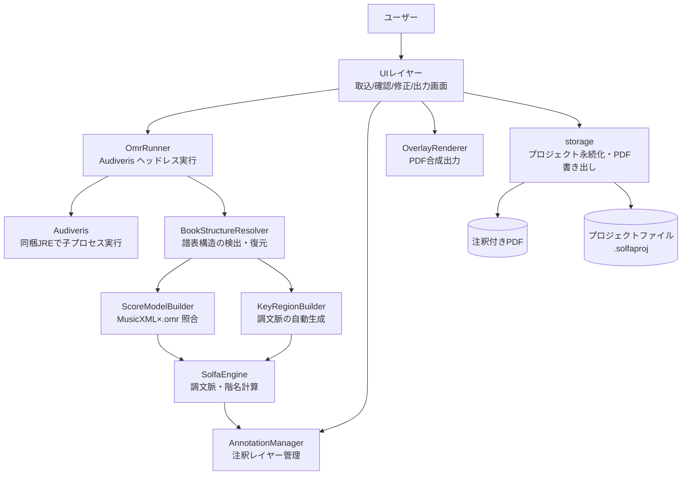
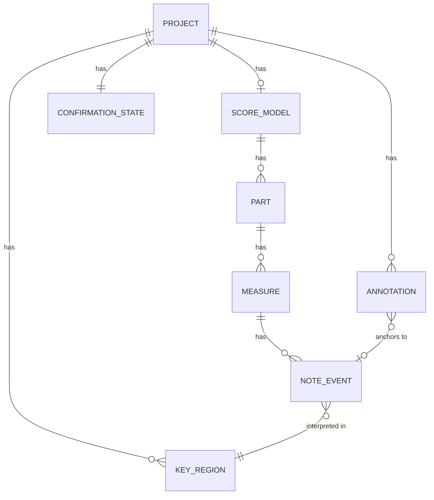
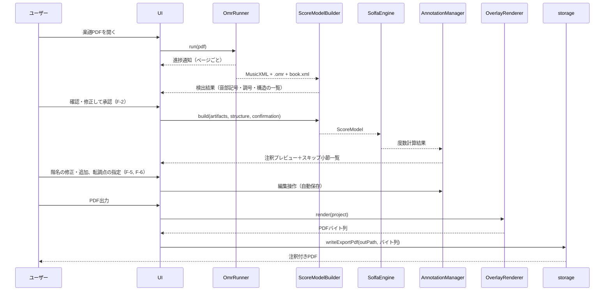
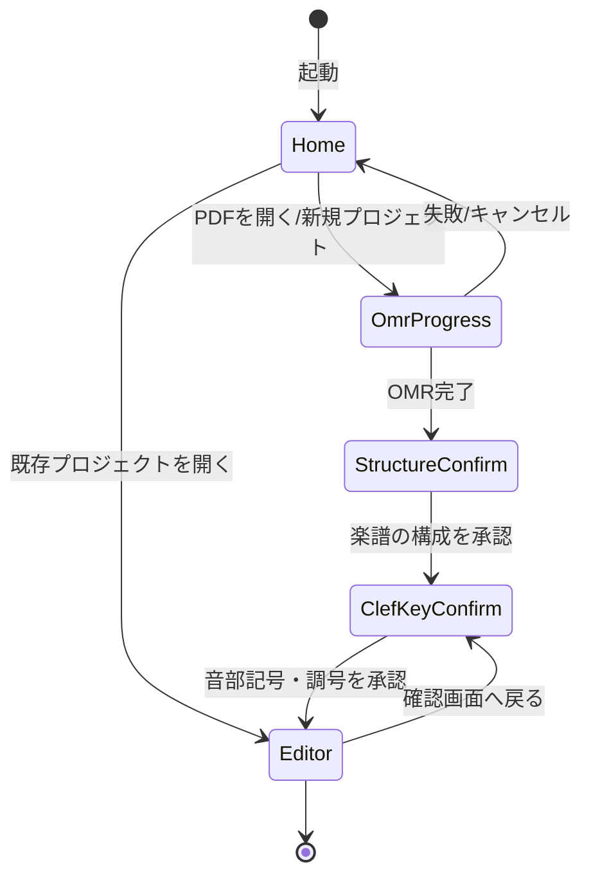

# 機能設計書 (Functional Design Document)

- 作成日: 2026-07-13
- 対応PRD: [docs/product-requirements.md](product-requirements.md)
- 対象範囲: v1（MVP: F-1〜F-5、P1: F-6）。v2の和音役割レイヤー（F-7）は拡張点のみ記載

## システム構成図

デスクトップアプリケーション（ローカル完結）。楽譜データはすべてローカルのプロジェクトファイル内で処理され、ネットワーク送信は行わない。



※ UI からの矢印は、型付きIPC経由で Main プロセスの IPCハンドラ（編成レイヤー）が受け、各コンポーネントへ委譲する呼び出しを表す。注釈の編集結果の永続化も IPCハンドラが AnnotationManager（計算）の結果を ProjectStore（永続化）へ渡す形で編成し、ドメインロジックから ProjectStore への直接依存はしない（[アーキテクチャ設計書](architecture.md)の依存方向を参照）。PDF出力も同様に、IPCハンドラが OverlayRenderer（バイト列生成）の結果を storage の書き出し処理（`writeExportPdf`）へ渡して注釈付きPDFを出力する。

## 技術スタック

| 分類             | 技術                                       | 選定理由                                                                                                                                                           |
| ---------------- | ------------------------------------------ | ------------------------------------------------------------------------------------------------------------------------------------------------------------------ |
| アプリ形態       | デスクトップアプリ（Electron）             | OMR（Audiveris＝Java）をWASM化するのは非現実的。子プロセス実行と同梱配布ができ、ローカル完結要件（PRD セキュリティ要件）を満たす                                   |
| 言語             | TypeScript                                 | UI・解析・出力を単一言語で実装し配布を単純化。プロトタイプの解析部はPython標準ライブラリのみ＝外部ライブラリ非依存のロジックであり、TypeScriptへの移植コストが低い |
| OMR              | Audiveris（同梱JREでヘッドレス実行）       | プロトタイプで検証済み（`GDK_SCALE=1`、`-Djava.awt.headless=true`）。MusicXMLと.omrの2出力が本設計の前提                                                           |
| 画面上の楽譜表示 | PDF.js                                     | 元PDFのページ画像化と注釈オーバーレイ表示（修正UI）                                                                                                                |
| PDF出力          | pdf-lib                                    | 元PDFを再エンコードせずページに描画を追加できる                                                                                                                    |
| 楽譜解析         | 自前実装（MusicXML/.omr パーサ＋階名計算） | v1に必要な解析は自前で足りることをプロトタイプで実証済み。music21（Python）はv2の和音解析で導入を再検討                                                            |
| テスト           | Vitest ＋ Playwright                       | ユニット／E2E                                                                                                                                                      |

## データモデル定義

### 設計原則

- 階名の内部表現は**「スケール度数＋変位」**で持ち、表示時に文字列化する。音節体系（コダーイ式/Tonic sol-fa略記）と短調基準（La/Do）の2軸は直交し、いつでも切替再表示できる
- **座標系は2本立て**: 解析は MusicXML の論理構造、描画位置は .omr のピクセル座標（300dpi基準）。ページのポイント座標へは線形スケールで変換する
- **注釈レイヤーは楽譜認識結果から分離**して永続化する。OMR再実行やユーザー修正で認識結果が変わっても、手動注釈と転調指定が生き残る設計とする

### エンティティ定義

```typescript
/** プロジェクト全体（プロジェクトファイルのルート） */
interface Project {
  schemaVersion: number; // project.json のスキーマ版数（v1 = 1）。互換性判定に使う
  id: string; // UUID
  sourcePdf: string; // プロジェクト内に取り込んだ元PDFの相対パス
  pages: PageInfo[]; // ページごとの画像サイズ・スケール係数
  score: ScoreModel | null; // OMR＋照合の結果（OMR未実行ならnull）
  confirmation: ConfirmationState; // 音部記号・調号の確認状態
  keyRegions: KeyRegion[]; // 調文脈（自動検出＋ユーザー指定の転調点）
  annotations: Annotation[]; // 注釈レイヤー（自動生成＋手動）
  settings: ProjectSettings;
  createdAt: string; // ISO 8601
  updatedAt: string;
}

interface PageInfo {
  pageIndex: number; // Audiveris のページ添字（= PageAnchor.pageIndex）。0始まり
  sourcePageIndex: number; // 元PDFのページ添字。0始まり。pageIndex とは一致しない（下記）
  widthPt: number; // 元PDFページの寸法（PDFポイント）。ページ回転 90/270 は適用済み
  heightPt: number;
  omrImageWidthPx: number; // .omr の座標基準（sheet 単位の画像）
  omrImageHeightPx: number; // ポイント座標へは軸ごとの線形スケールで変換
  interlinePx: number; // 譜線間隔。注釈の配置オフセットの基準
}
```

**`pageIndex` と `sourcePageIndex` は別物**（Phase 5 の実測で判明）:
Audiveris は 1 つの sheet（＝元PDFの1ページ）の中で movement 境界を検出すると **page を分割する**。
Victoria フィクスチャは 3 ページの PDF に対し **4 つの Audiveris ページ**を持ち、`sheet#1` が
page 0 と page 1 を含む。両者を同一視すると 2 ページ目以降の注釈が丸ごと別のページへ描かれる。
対応の正は book.xml の `<sheet><input><number>`（元PDFのページ番号）。

| フィクスチャ | 元PDFページ数 | Audiveris ページ数 | 対応        |
| ------------ | ------------- | ------------------ | ----------- |
| Victoria     | 3             | 4                  | `[0,0,1,2]` |
| divisi       | 20            | 20                 | 1:1         |

また `.omr` の画像寸法は **sheet 単位**で、A4 とは限らない
（Victoria 2480×3507px / divisi 2408×3150px）。寸法の決め打ちはできず、
元PDF から実寸を読んで x / y 別々にスケールを求める。

```typescript
/** 認識済み楽譜の論理＋物理モデル */
interface ScoreModel {
  parts: Part[]; // 例: Soprano/Alto/Tenor/Bass
  systems: SystemInfo[]; // ページ内の段。誤分割の統合結果を反映
  measures: Measure[]; // パート×小節
}

interface Part {
  id: string; // MusicXML part id（= book.xml logical-id）
  name: string;
  staves: StaffRef[]; // 譜表→パート対応（sheet XML の part id で解決）
}

interface Measure {
  partId: string;
  index: number; // 曲頭からの通し小節番号
  status: 'matched' | 'skipped'; // 照合結果。skipped は修正UIの対象
  notes: NoteEvent[];
}

/** 照合済みの音符1つ（MusicXMLの音楽情報＋.omrの座標） */
interface NoteEvent {
  id: string;
  partId: string;
  measureIndex: number;
  pitch: Pitch; // MusicXML由来
  head: PageAnchor; // .omr由来の符頭座標（300dpi px）
  solfa: SolfaDegree | null; // 計算結果。休符等はnull
}

interface Pitch {
  step: 'A' | 'B' | 'C' | 'D' | 'E' | 'F' | 'G';
  alter: number; // -2〜+2（記譜上の変位。調号込みの実音）
  octave: number;
}

interface PageAnchor {
  pageIndex: number;
  x: number; // .omr 300dpi画像ピクセル
  y: number;
}

/** 階名の内部表現（表示文字列はSolfaEngineが導出） */
interface SolfaDegree {
  degree: 1 | 2 | 3 | 4 | 5 | 6 | 7; // 現在の「do」を1とするダイアトニック度数
  alteration: number; // ダイアトニック音からの半音変位。通常 -1/0/+1、重変化で ±2（±2は文字列化時にフォールバック表示）
}

/** 調文脈。転調点で区切られた区間ごとに1つ */
interface KeyRegion {
  id: string;
  start: ScorePosition; // この調が始まる位置
  tonicStep: Pitch['step']; // 主音
  tonicAlter: number;
  mode: 'major' | 'minor';
  source: 'auto' | 'user'; // 自動検出（調号変更）かユーザー指定か
}

interface ScorePosition {
  measureIndex: number;
  offset: number; // 小節内オフセット（divisions基準）。小節頭は0
}

/** 音部記号・調号の確認画面（F-2）の状態 */
interface ConfirmationState {
  items: ConfirmationItem[];
  completedAt: string | null; // 未完了なら階名生成に進めない
}

/**
 * 音部記号の確認項目
 *
 * **譜表 1 段につき 1 行ではなく、(パート, 検出音部記号) のグループにつき 1 行**。
 * 実データの誤検出はパート単位で系統的に起きる（divisi の P6 は 35 段が一括で ALTO 誤検出）
 * ため、この単位に畳んでも訂正能力を失わない。実測: Victoria 36 譜表 → 5 行 /
 * divisi 288 譜表 → 17 行。畳まないと「1曲5分以内」（PRD F-2）を満たせない。
 *
 * `kind` を 'clef' に限定しているのは、調号は譜表ではなく小節区間の性質であり
 * `KeyRegionDecision` が、譜表構造は `StructureDecision` が担うため
 * （1 つの訂正概念に型が 1 つだけ対応する状態を保つ）。
 */
interface ConfirmationItem {
  id: string; // `clef-<partId>-<detected>` 形式（決定的。再解析後も同じ行に訂正を戻せる）
  kind: 'clef';
  partId: string | null;
  detected: string; // 検出値（例: 'ALTO', 'TREBLE_DOWN_8'）。未検出は 'UNKNOWN'
  corrected: string | null; // ユーザー修正値。nullなら検出値を採用
  staffRefs: StaffRef[]; // グループに属する全譜表。訂正はこの全てに適用される
  clipRect: PageAnchor & { width: number; height: number }; // 元画像の切り抜き範囲
  mismatchCount: number; // 音高クロスチェック不一致の件数（そのまま誤検出の疑わしさ）
}

interface StaffRef {
  pageIndex: number;
  systemIndex: number;
  staffIndex: number;
  partId: string | null;
}

/** 注釈（出力PDFに描画される単位） */
interface Annotation {
  id: string;
  layer: 'solfa' | 'chordRole'; // chordRole は v2
  anchor: PageAnchor; // 描画位置（衝突回避で調整後の位置）
  noteId: string | null; // 自動生成注釈は元音符を参照。手動追加はnull
  text: string | null; // 手動上書き文字列。nullなら solfa から導出
  origin: 'auto' | 'manual';
  deleted: boolean; // 自動生成注釈の非表示化（再生成で復活させない）
}

/** 設定（PRD F-3の決定事項） */
interface ProjectSettings {
  syllableSystem: 'kodaly' | 'tonicSolfa'; // デフォルト: 'kodaly'
  minorBasis: 'la' | 'do'; // デフォルト: 'la'
  diatonicColor: string; // デフォルト: 濃赤
  chromaticColor: string; // デフォルト: 紫
  fontFamily: string; // 小サイズ判読性を選定基準とする（PRD F-4）
  fontSizePt: number;
}
```

**制約**:

- `ConfirmationState.completedAt` が null の間は階名生成・PDF出力に進めない（F-2の受け入れ条件）
- **承認後に訂正を入れると `completedAt` は null に戻る**。承認は「この解析結果を人が確認した」
  という記録であり、訂正後の解析結果は別物のため（設定変更は「何を確認したか」を変えないため対象外）
- `KeyRegion` は `start` 昇順で重複なし。先頭要素は曲頭（measureIndex=0, offset=0）に必ず存在する
  （`KeyRegionBuilder` が曲頭の既定を必ず置いて担保し、`SolfaEngine.computeDegrees` が契約として検証する）
- `Annotation.noteId` を持つ注釈は、OMR再実行時に音符IDの再照合で引き継ぐ。照合できない場合は孤立注釈として修正UIに提示する

### ER図



## コンポーネント設計

### OmrRunner

**責務**:

- 同梱 Audiveris のヘッドレス子プロセス実行と進捗通知（F-1）
- MusicXML・.omr（zip内sheet XML）・book.xml の取得と展開

**インターフェース**:

```typescript
class OmrRunner {
  // 子プロセス起動（spawn）は DI 可能。既定は node:child_process.spawn を shell:false で使用
  constructor(deps?: { spawn?: SpawnFn; audiverisPath?: string });
  run(pdfPath: string, onProgress: (p: OmrProgress) => void): Promise<OmrArtifacts>;
  cancel(): void;
}
```

**実装の構成**（`src/main/omr/`）:

- `OmrRunner.ts`: オーケストレーション（副作用の入口）。一時ディレクトリ作成→spawn→stdout 行を
  `parseProgressLine` で進捗化→正常終了後に出力を収集→`assembleArtifacts`→後片付け。
- `audiverisCommand.ts`（純粋）: `buildAudiverisArgs`（引数配列。`--` 以降に PDF パスを分離）/
  `buildAudiverisEnv`（`-Djava.awt.headless=true`、Linux は `GDK_SCALE=1`）/ `parseProgressLine`。
- `omrArchive.ts`（純粋）: fflate による zip 展開（パストラバーサル拒否）と `assembleArtifacts`
  （`.omr`→`sheet#N/sheet#N.xml` を N 昇順にページ化、`.mxl`→`META-INF/container.xml` 経由で本体
  MusicXML を取り出す）。domain のパーサへ委譲。
- `errors.ts`: `OmrRunError`（起動・実行・出力収集の失敗）/ `OmrArchiveError`（zip・パストラバーサル）。
- 進捗型は `src/shared/types/OmrProgress.ts`（`phase` / `sheet` / `totalSheets` / `message`）。

**依存関係**: Audiveris（子プロセス）、fflate（zip）

> **申し送り**: 本物の Audiveris を起動しての E2E 動作確認は、コンテナに Audiveris/JRE が非搭載の
> ため実施できず、ホスト実機での手動確認に委ねる（GUI 起動確認と同じ扱い）。DI した spawn に
> 擬似プロセスを注入し、進捗パース・zip 展開・成果物組み立て・キャンセルは単体テスト済み。
> `parseProgressLine` のログ書式は代表パターンで実装しており、実ログでの調整余地がある。

### BookStructureResolver

**責務**:

- book.xml の movement 分割情報と sheet XML から、インチピット等による譜表構造の誤分割を検出する（プロトタイプで実際に発生した系統的エラー。機械的に復元できることを検証済み）
- 復元候補（システムの統合・譜表→パート割当）を生成し、StructureConfirm 画面の表示材料を提供する
- ユーザーの承認・修正結果を適用した確定構造（`ResolvedStructure`）を出力する

**インターフェース**:

```typescript
class BookStructureResolver {
  // 構造上の問題の検出（例外は投げず StructureIssue[] を返す）
  detect(artifacts: OmrArtifacts, bookPages: BookPageRef[]): StructureIssue[];
  // 確定構造の組み立て（decisions 省略時は検出結果をそのまま採用）
  resolve(
    artifacts: OmrArtifacts,
    bookPages: BookPageRef[],
    decisions?: StructureDecision[],
  ): ResolvedStructure;
}
```

> `bookPages`（`parseBookXml` の結果）を引数に取るのは、movement とページの対応が book.xml に
> しかないため。`OmrArtifacts` を汚さず、既存パーサの戻り値をそのまま渡せる形にしている。

**中核: 段ごとの小節番号アンカー**

`resolve` の要点は、**段（システム）ごとの通し小節番号をここで確定させる**ことにある。
段の小節数は「ユーザー判断 → MusicXML の段レイアウト（`<print new-system>` / `<print new-page>`）
→ .omr の stack 数」の順に決まり、必ず値が決まる。

これは実データで裏付けられた設計判断である。divisi 実フィクスチャでは 20 ページ中 2 段だけ
.omr の stack 数が MusicXML より 1 つ多く、ScoreModelBuilder が stack 数を累積していたために
そのズレが以降の全ページへ波及していた（skipped 561）。アンカー方式でズレが当該段に閉じ、
skipped 135・照合音符 3500 へ改善した（`tests/fixtures/divisi/README.md`）。

**検出する StructureIssue**:

| kind                           | 内容                                                         |
| ------------------------------ | ------------------------------------------------------------ |
| `movementCountMismatch`        | book.xml の movement 分割数と MusicXML の数が違う            |
| `pageCountMismatch`            | movement のページ数が MusicXML のページ数と違う              |
| `systemCountMismatch`          | ページ内の段数が MusicXML の段数と違う                       |
| `systemMeasureCountMismatch`   | 段の stack 数が MusicXML の小節数と違う（MusicXML 側を採用） |
| `inconsistentSystemStaffCount` | 同一ページ内で段ごとの譜表数が不揃い（段検出が疑わしい警告） |
| `pageCorrespondenceMismatch`   | book.xml のページ数と sheet XML を持つページ数が違う（下記） |

> **ページ対応が壊れている場合**: `OmrArtifacts.pages` は sheet XML を持つページだけを連結した
> 配列のため、book.xml のページ数と一致するときに限り「k 番目 ↔ k 番目」の対応が成立する。
> 数が違う場合、どのページが欠けたかはこの情報だけでは決められないので、
> **推測でアンカーせず** .omr の stack 数へフォールバックし、`pageCorrespondenceMismatch` で報告する
> （黙って小節番号をずらさない）。detect と resolve はこの対応づけ規則を共有する。

> **誤分割の統合について**: Audiveris が 1 つの物理システムを複数の system に分断することが実際に
> あるが、**MusicXML 側も同じ分断で出力される**ため、OMR 側だけを統合すると整合が崩れる。
> 現状は `inconsistentSystemStaffCount` として検出・報告するに留め、自動統合は行わない。

**依存関係**: OmrRunner の成果物（book.xml・sheet XML）、MusicXmlParser の段レイアウト

### ScoreModelBuilder

**責務**:

- MusicXML（論理）と .omr（座標）の照合による `ScoreModel` 構築。譜表構造は BookStructureResolver の確定結果（`ResolvedStructure`）を前提とする
- 小節単位の音符数突き合わせ。不一致小節は `skipped` として隔離し、他小節へ波及させない（プロトタイプで実証済みの方式）
- 音高のクロスチェック: .omr の譜表位置＋音部記号から逆算した音名と MusicXML の音名を照合し、不一致を確認画面の材料にする

**インターフェース**:

```typescript
class ScoreModelBuilder {
  build(
    artifacts: OmrArtifacts,
    structure: ResolvedStructure,
    confirmation: ConfirmationState,
  ): BuildResult;
  // BuildResult = { score: ScoreModel; issues: BuildIssue[] }
}
```

**依存関係**: OmrRunner の成果物、BookStructureResolver の確定構造

### KeyRegionBuilder

**責務**:

- MusicXML の調号宣言（`<key><fifths>`）から調文脈（`KeyRegion[]`）を自動生成
- movement ローカルの小節番号を確定構造のアンカー経由で通し小節番号へ変換
- パートごとに調号を持続計算し、小節単位の多数決で 1 つに決める
- 検出した問題は例外にせず `KeyRegionIssue` として部分結果と共に返す
- ユーザー訂正（`decisions`）は**自動生成が終わってから**適用する（生成中に混ぜない）。
  旋法だけの訂正は調号を保ったまま平行調へ移し、`source` を `'user'` にする。
  訂正の結果として隣接区間が同じ調になったらマージする（存在しない転調点を描かせない）。
  既存区間の開始位置と一致しない訂正は `unmatchedKeyDecision` として報告する
  （区間の新規挿入は F-6 の担当であり、本コンポーネントは既存区間の訂正しか行わない）

**インターフェース**:

```typescript
class KeyRegionBuilder {
  build(
    artifacts: OmrArtifacts,
    structure: ResolvedStructure,
    decisions?: readonly KeyRegionDecision[], // ClefKeyConfirm での旋法・調号の訂正
  ): KeyRegionBuildResult;
  // KeyRegionBuildResult = { keyRegions: KeyRegion[]; issues: KeyRegionIssue[] }
  // KeyRegionDecision = { measureIndex: number; fifths?: number; mode?: 'major' | 'minor' }
}

type KeyRegionIssue =
  // 同じ小節でパートごとに有効な調号が食い違う（多数決で 1 つに決めた）
  | {
      kind: 'keySignatureConflict';
      measureIndex: number;
      fifthsByPart: Record<string, number>;
      adopted: number;
    }
  // 五度圏の範囲（-7〜+7）を外れた調号。その宣言は無視し直前の調号を維持する
  | { kind: 'unsupportedKeySignature'; measureIndex: number; partId: string; fifths: number };
```

`ScoreModelBuilder` と**同じ入力**を取り、同じ基準（`structureAnchors`）で通し小節番号へ変換する。
これにより照合結果と調文脈の小節番号が必ず揃う。`ResolvedStructure` と `OmrArtifacts` の
不整合（movement が指す MusicXML の欠落・movement 間の小節番号の重複／曲順の逆転）は、
`ScoreModelBuilder` と同じく**呼び出し側の契約違反として例外**にする。
**同じ入力に対する受理／拒否は両者で必ず一致させる**（片方だけが並べ替え等で救うと、
壊れた構造が一方では「正常」として通ってしまう）。

曲頭の既定 KeyRegion を置く際、最初に検出された調が既定（ハ長調）と**同じ調**であれば
区間を分けず開始位置を曲頭へ移す。単純に前置きすると転調していないのに同じ調の KeyRegion が
2 つ並び、転調点 UI（F-6）が存在しない転調点を描いてしまう（調号なしの楽譜で必ず起きる）。

**実データの制約（重要）**:
Audiveris は `<key><fifths>` のみを出力し **`<mode>` を書かない**（Victoria・divisi 両フィクスチャの
全宣言で確認）。このため**長調/短調の自動判別はできず**、自動生成される `KeyRegion` は全て長調になる。
この影響は**短調基準（`minorBasis`）によって異なる**。実装時の検証（Phase 4）で判明した:

- **La 基準**: 影響を受けない。La 基準は短調の主音を La と数える＝ do を「主音の短3度上」に置くため、
  do の位置は平行長調の主音と一致する。自動判定の「常に長調（＝平行長調）」のままでも
  階名は正しく、実際に統合テストで両者の階名が完全一致することを確認した
- **Do 基準**: 影響を受ける。短調の主音を Do と数えるため、平行長調として解釈されると
  階名が 5 度分ずれる

したがって**旋法の指定が必須なのは Do 基準のユーザー**である。とはいえ調区間の表示（「イ短調」と
出るか「ハ長調」と出るか）と v2 の和音役割分析はどちらの基準でも旋法を要求するため、
**ClefKeyConfirm（F-2）で調の長短を指定できるようにすること**自体は引き続き必要である。

> 補足: 当初は「La 基準の移動ドが自動では効かない」と記述していたが、上記のとおり不正確だった。
> Phase 4 の実装検証で `SolfaEngine.resolveDo` を追って判明し、記述を訂正した。

また実データでは曲頭に調号宣言がない（Victoria は通し 28 小節目、divisi は 48 小節目が初出）ため、
曲頭には既定のハ長調を必ず置く（`KeyRegion` の「先頭要素は曲頭に必ず存在する」制約の担保）。

**依存関係**: MusicXmlParser の出力、BookStructureResolver の確定構造

### SolfaEngine

**責務**:

- `KeyRegion` 列から各音符の調文脈を解決し、`SolfaDegree`（度数＋変位）を計算
- 設定（音節体系×短調基準）に応じた表示文字列の導出

**インターフェース**:

```typescript
class SolfaEngine {
  computeDegrees(
    score: ScoreModel,
    keyRegions: readonly KeyRegion[],
    basis: MinorBasis,
  ): Map<string, SolfaDegree>;
  toSyllable(degree: SolfaDegree, settings: ProjectSettings): string;
}

/** 階名計算結果を反映した新しい ScoreModel を返す（非破壊） */
function applyDegrees(score: ScoreModel, degrees: ReadonlyMap<string, SolfaDegree>): ScoreModel;
```

- `basis`（短調基準）は第3引数として受け取る。これがないと短調の do の位置が決まらないため、
  1音符版の `computeDegree(note, region, basis)` と引数を揃えた
- `keyRegions` は「非空・先頭が曲頭（measureIndex=0, offset=0）・小節番号の昇順で重複なし」を
  **契約**とし、違反は例外にする（認識エラーではなく呼び出し側が組んだデータの不整合のため）
- 各音符の調文脈は通し小節番号から二分探索で引く
- `applyDegrees` は `Map` を `ScoreModel` へ反映する純粋関数。注釈生成（AnnotationManager）と
  通し回帰テストのために用意する。**結果のない音符は既存の `solfa` を保つ（上書きしない）**
  マージ意味論とし、転調指定変更時の範囲限定再計算（性能要件）で範囲外の階名が無言で消えないようにする

**既知の限界**: `NoteEvent` は小節内オフセットを持たないため `KeyRegion.start.offset` は無視され、
転調はその小節の先頭から適用される。自動生成の `KeyRegion` は必ず offset=0 のため現時点で実害はない。
小節途中の転調指定（F-6）を実装する際に `NoteEvent` へオフセットを持たせるか判断する。

**依存関係**: ScoreModel、KeyRegion

### AnnotationManager

**責務**:

- 階名計算結果からの注釈自動生成（配置の衝突回避を含む）
- 手動注釈の追加・編集・削除、自動注釈の上書き（F-5）
- 転調指定変更時の再計算と、手動修正の保全

**インターフェース**:

```typescript
interface RegenerateInput {
  score: ScoreModel; // applyDegrees 済み（note.solfa が入っている）
  geometry: readonly PageGeometry[]; // .omr 由来の記号の矩形。添字は Audiveris ページ
  pages: readonly PageInfo[]; // ページ寸法（buildPageInfos の結果）
  settings: ProjectSettings;
  existing: readonly Annotation[]; // 手動注釈・deleted・手動上書きの引き継ぎ元
}

class AnnotationManager {
  regenerate(input: RegenerateInput): { annotations: Annotation[]; issues: AnnotationIssue[] };
  add(anchor: PageAnchor, text: string, id: string): Annotation;
  update(annotations, id, patch: Partial<Omit<Annotation, 'id'>>): Annotation[];
  remove(annotations, id): Annotation[]; // 自動注釈は消さずに deleted を立てる
  listSkippedMeasures(score: ScoreModel): Measure[]; // 修正UIのジャンプ先一覧
}
```

**引数を `regenerate(score, degrees)` から変えた理由**:

1. `degrees` は不要。`SolfaEngine.applyDegrees` 済みの `ScoreModel` が `note.solfa` を持つ
2. 配置に記号の矩形（`geometry`）とページ寸法・設定が要る
3. 手動修正の保全には既存注釈列が要る

**注釈 id は `solfa-<noteId>`**。音符 id から決まるため再解析しても同じ id になり、
`deleted` と手動上書き `text` を id だけで引き継げる（`mergeCorrections` と同じ考え方）。
対応する音符が消えた自動注釈は捨てずに残し、`orphanAnnotation` として報告する。

### OverlayRenderer

**責務**:

- 元PDFの版面を変更せず、注釈を重ね書きしたPDFのバイト列を生成（F-4）
- .omr ピクセル座標→PDFポイント座標の線形変換
- モノクロ印刷でも判読できるスタイル（色＋書体差）の適用
- ファイルへの書き込みは行わない（domain の純粋性維持）。IPCハンドラが生成結果を storage の書き出し処理（`writeExportPdf`）へ渡して編成する

**インターフェース**:

```typescript
class OverlayRenderer {
  render(input: { sourcePdf: Uint8Array; project: Project }): Promise<{
    bytes: Uint8Array;
    issues: RenderIssue[];
    drawnCount: number;
  }>;
}
```

**引数を `render(project)` から変えた理由**: `Project.sourcePdf` はプロジェクト内の
**相対パス文字列**であり、domain はファイルを読めない。元PDFのバイト列を受け取る。

**実装上の決定**:

- 元PDFを `PDFDocument.load` して**描き足すだけ**にする。新しいドキュメントへページを
  複製すると版面・埋め込みフォント・しおりが失われる
- 書体は標準14フォント（`sans-serif`→Helvetica / `serif`→TimesRoman / `monospace`→Courier）。
  未知の名前は既定へ落とし、**設定の綴り間違いで出力を失敗させない**
- 文字寸法の計測は `fontMetrics` に集約し、**配置（AnnotationManager）と描画が同じ関数で測る**。
  別々に測ると「配置は収まると判断したのに描画では重なる」食い違いが生じる
- 描けない文字・ページ寸法の欠落・色の解釈失敗はいずれも例外にせず `RenderIssue` で報告する
  （部分失敗で出力全体を落とさない）

**依存関係**: pdf-lib

### ProjectStore

**責務**:

- プロジェクトファイル（.solfaproj）の保存・読込・自動保存（信頼性要件: 修正作業の永続化）

**インターフェース**:

```typescript
class ProjectStore {
  create(): Project; // 引数を取らない（下記参照）
  readSourcePdf(sourcePdfPath: string): Promise<Uint8Array>;
  save(
    path: string,
    project: Project,
    sourcePdf: Uint8Array,
    omr: OmrRawArtifacts,
  ): Promise<Project>;
  load(path: string): Promise<ProjectArchive>;
  // ProjectArchive = { project: Project; sourcePdf: Uint8Array; omr: OmrRawArtifacts }
}
```

**設計上の決定**:

- `create()` は元PDFのパスを取らない。`Project.sourcePdf` はプロジェクト内の**固定相対パス**
  （`source.pdf`）であり、取り込み元の絶対パスを持つとファイルを移動・共有した先の環境で
  無効な参照になるため
- `save` は原子的に書く（**保存先と同じディレクトリ**の一時ファイル → リネーム。OS のテンポラリ領域に
  置くとクロスデバイスでリネームが失敗する）。保存前に直前版を `.bak1..3` へ世代退避し、
  **退避後に最終リネームが失敗した場合は `.bak1` を本体の位置へ戻す**
  （戻さないと「保存に失敗したらファイルが消えた」状態になる）
- 自動保存は編成レイヤー（`ProjectSession`）が 300ms デバウンスで予約する。保存先が未確定の間
  （PDF 取り込み直後）は書けないため予約しない。**ファイルを開いた直後の解析では保存しない**
  （開いただけでバックアップ世代を 1 つ消費してしまうため）

### writeExportPdf（storage）

**責務**:

- OverlayRenderer が生成した注釈付きPDFのバイト列を、ユーザー指定パスへ原子的に書き出す（一時ファイルに書いてからリネームし、書き込み途中の失敗で不完全なPDFを残さない。エラーハンドリング表「PDF出力失敗」に対応）

**インターフェース**:

```typescript
function writeExportPdf(outPath: string, pdfBytes: Uint8Array): Promise<void>;
```

**依存関係**: なし（Node.js fs のみ。呼び出しは IPCハンドラが編成する）

## アルゴリズム設計

### 階名計算（SolfaEngine）

**目的**: 調文脈と記譜音高から、音節体系に依存しない内部表現（度数＋変位）を計算する

#### ステップ0: 調文脈の解決

- 音符の通し小節番号から、その位置で有効な `KeyRegion` を二分探索で引く
- **実データの制約**: Audiveris が `<mode>` を出力しないため自動生成の `KeyRegion` は全て長調になり、
  ステップ1の分岐のうち短調側はユーザー指定（F-2 / F-6）がない限り選ばれない

#### ステップ1: 「do」の位置の決定

- `mode === 'major'` または `minorBasis === 'do'`: do = KeyRegion の主音
- `mode === 'minor'` かつ `minorBasis === 'la'`: do = 平行長調の主音（主音の短3度上。例: イ短調 → do = C）

#### ステップ2: 度数の決定

- do の音名（step）から対象音の音名までの幹音距離（レター距離）で度数を決める
- 計算式: `degree = ((stepIndex(note) - stepIndex(do) + 7) % 7) + 1`

#### ステップ3: 変位の決定

- do を主音とする長音階における当該度数の期待変位（調号由来）と、実音の変位との差を取る
- 計算式: `alteration = note.alter - expectedAlterInDoMajor(doPitch, degree)`
- 例（do=G、F♮）: 度数7の期待は F♯（+1）、実音 F♮（0）→ alteration = -1

**expectedAlterInDoMajor の計算手順**（do長音階における度数 d の期待変位）:

```
NATURAL_SEMITONES = { C:0, D:2, E:4, F:5, G:7, A:9, B:11 }   // 幹音の半音位置
MAJOR_SCALE_OFFSETS = [0, 2, 4, 5, 7, 9, 11]                  // 度数1〜7 の do からの半音数

function expectedAlterInDoMajor(doPitch, d):
  targetStep       = doPitch.step の幹音を (d - 1) つ進めた音名        // 例: do=G, d=7 → F
  expectedSemitone = (NATURAL_SEMITONES[doPitch.step] + doPitch.alter
                      + MAJOR_SCALE_OFFSETS[d - 1]) mod 12             // 例: (7 + 0 + 11) mod 12 = 6
  return signedDiff12(expectedSemitone - NATURAL_SEMITONES[targetStep])
         // 半音差を -2〜+2 の最小絶対値に正規化。例: 6 - 5 = +1（F♯）
```

- 検算: 結果は do を主音とする長調の調号と必ず一致する（do=G なら F のみ +1、do=E♭ なら B/E/A が -1）。ユニットテストでは全24調についてこの性質を表駆動で検証する

#### ステップ4: 文字列化（表示時のみ）

| 度数 | 変位0 (コダーイ式) | +1  | -1  | 変位0 (Tonic sol-fa略記) | +1  | -1  |
| ---- | ------------------ | --- | --- | ------------------------ | --- | --- |
| 1    | do                 | di  | —   | d                        | de  | —   |
| 2    | re                 | ri  | ra  | r                        | re  | ra  |
| 3    | mi                 | —   | me  | m                        | —   | ma  |
| 4    | fa                 | fi  | —   | f                        | fe  | —   |
| 5    | so                 | si  | se  | s                        | se  | —   |
| 6    | la                 | li  | le  | l                        | le  | —   |
| 7    | ti                 | —   | te  | t                        | —   | ta  |

- 各列はそれぞれの流儀の規則に厳密に従う: コダーイ式は幹音の7度を **ti** と綴り、上げは母音 i（di, ri, fi, si, li）、下げは ra/me/se/le/**te**。Tonic sol-fa（Curwen式）は幹音の7度を te（略記 t）と綴り、上げは母音 e（de, re, fe, se, le）、下げは母音 a（ra, ma, **ta**）。同じ「下げた7度」がコダーイ式では te、Tonic sol-fa 略記では ta になる点に注意（両者を混用しない）
- Do基準短調では自然短音階の3・6・7度が変位-1として me/le/te で現れる。La基準では同じ音が度数1・4・5（do/fa/so）の変位0として現れ、表全体は共通に使える（2軸直交の担保）。例: イ短調の C/F/G は、Do基準では me/le/te、La基準では平行長調ハ長調の do/fa/so
- 表の空欄・稀な変位（重変化含む）は「異名同音に読み替えず、変位記号付き文字列（例: `do♯♯`）」でフォールバック表示する

**実装例**:

```typescript
function computeDegree(note: Pitch, region: KeyRegion, basis: 'la' | 'do'): SolfaDegree {
  const doPitch = resolveDo(region, basis); // ステップ1
  const degree = letterDistance(doPitch.step, note.step); // ステップ2
  const alteration = note.alter - expectedAlterInDoMajor(doPitch, degree); // ステップ3
  return { degree, alteration };
}
```

### 小節照合（ScoreModelBuilder）

**目的**: MusicXMLの音符列と.omrの符頭座標列を突き合わせ、誤りを小節単位に閉じ込める

1. sheet XML の `part id`（= book.xml の logical-id）で譜表→パートを対応付ける
2. パート×小節ごとに、MusicXMLの発音音符数と.omrの符頭数を比較する
3. 一致: 同 offset の音群を「同時に鳴る列」として時間順に並べ、x 昇順の符頭を列サイズどおり先頭から貪欲に切り出す（総数一致を照合済みのため x 距離の閾値は不要）。列内は縦位置（符頭の譜表位置 × 幹音の絶対音高、いずれも高い音から）で対にする。これにより和音・オクターブ重複 divisi・異リズム多声（backup/forward）でも対応が一意に決まる。対ごとに .omr符頭の譜表位置（中線=0・下向き正）＋確認済み音部記号から音名を逆算して MusicXML の音名とクロスチェックする（実 Audiveris フィクスチャ Victoria で 808音・クロスチェック不一致0 を確認。`tests/fixtures/victoria/`）
4. 不一致: 当該小節を `skipped` とし、修正UIの一覧に登録する（Victoria 実測: 295 matched 中 skipped 1 小節）。ユニゾン共有符頭（1符頭に2声部）も現状はこの扱い（照合の緩和は実フィクスチャでの Audiveris 実出力確認後に判断）

**通し小節番号は累積しない**: 小節番号は `ResolvedStructure` の段アンカー
（`firstMeasureIndex` + stack 添字）から引く。段の `measureCount` と .omr の stack 数は食い違い得るため、
両方向を issue にする（いずれも段の中で閉じ、後続段の番号には影響しない）:

| 状況                                  | 扱い                                                    |
| ------------------------------------- | ------------------------------------------------------- |
| stack はあるが対応する論理小節がない  | `measureOutOfRange`（その stack を捨てる）              |
| 論理小節はあるが対応する stack がない | `measureNotDetected` ＋ 当該小節を `skipped` として残す |

後者を `skipped` として残すのは、黙って小節を欠落させると `SystemInfo.measureCount` が
ScoreModel の実態と食い違い、下流（OverlayRenderer・手動修正UI）が存在しない小節を参照するため。

**構造の契約検証**: movement 間で通し小節番号が重複する `ResolvedStructure` は、別 movement の音符が
同じ `Measure` に混入するため例外にする（認識エラーではなく呼び出し側の契約違反）。
movement の先頭小節は段の並び順に依存しないよう `firstMeasureIndex` の最小値を採る。

> **実データ検証の限界（2026-07 時点）**: divisi 曲（`tests/fixtures/divisi/`）では構造解決後も
> クロスチェック不一致が 569 件残る。その 86%（487件）は「MusicXML の音名が .omr 由来より
> 幹音 1 つ低い」という系統的なズレで、402 件が P6 に集中している。P6 は 35 段で `ALTO`
> （ハ音記号）と検出されており、アルト記号の中線 C4 とト音記号の中線 B4 はちょうど幹音 1 つ違う。
> つまりこれは**音部記号の誤検出**であり、列対付けの取り違えではない。ClefKeyConfirm（F-2）で
> ユーザーが修正する対象であり、ScoreModelBuilder は既に `ConfirmationState` の clef 修正値を
> 受け取れる。
>
> 併せて、Audiveris が段ごとに譜表→パート id を割り当て直す現象も残る。MusicXML 側も同じ割当で
> 出力されるため OMR 側だけの再割当では整合が取れず、正しい声部同定には MusicXML のパート
> 再スライスが必要（現時点ではスコープ外）。

### 注釈配置と衝突回避（AnnotationManager）

**目的**: 階名を符頭の直上に置きつつ、臨時記号等との重なりを避ける（PRD F-4／プロトタイプの改善課題2）

1. 基本位置: 符頭中心の直上、譜線間隔に比例した固定オフセット
2. .omr が持つ近傍記号のバウンディングボックスと注釈の描画矩形の交差を判定する。
   ただし**符幹（stem）と加線（ledger）は障害物にしない**（下記）。
   和音・段全体を覆う**集約要素**（`head-chord` / `beam-group` / `staff-barline` 等）も除く。
   これらを入れると譜面の大半が「埋まっている」ことになり配置が破綻する
3. 交差する場合は候補位置 10 段（さらに上→符頭直下→さらに下→左右斜め上→2段上下→左右斜め下）の
   順に空きを探し、最初に交差しない位置を採用する。**先に置いた注釈も障害物として扱う**ため、
   注釈どうしも重ならない
4. どの候補も交差する場合は基本位置に置き、`placementUnresolved` として報告して人間の調整に委ねる

**符幹・加線を障害物にしない理由（実測）**: これらは幅数pxの細い線で、階名文字が重なっても
判読を妨げない（手書きの階名も符幹をまたいで書く）。設計どおり全記号を避けると、
衝突相手の 8 割が符幹になり配置品質が大きく落ちる。

| 指標（符頭直上をそのまま使えた割合＝配置品質） | 全記号を回避        | 細線を許容（採用） |
| ---------------------------------------------- | ------------------- | ------------------ |
| Victoria: 基本位置を採用                       | 349 / 808（43.2%）  | **721（89.2%）**   |
| divisi: 基本位置を採用                         | 755 / 3500（21.6%） | **2138（61.1%）**  |
| divisi: 配置不能（警告行き）                   | 123（3.5%）         | **29（0.8%）**     |

全記号を避けると Victoria は**注釈の 57% が符頭の真上から追い出される**（多くは符頭の下へ回る）。

**衝突判定の高さはアセンダ高を使う**（em 全体ではない）。階名の音節は小文字のみで
ディセンダを持たないため、em 全体で判定すると実際は空いている位置を「埋まっている」と誤判定し、
divisi の配置不能が倍増する。

**探索の効率化**: 障害物と配置済み注釈は一様格子（セル = 譜線間隔 × 4）に索引する。
ページあたり障害物 930・注釈 283 の実測に対し、候補 10 段の総当たりでは
5,000 注釈の性能要件（アーキテクチャ設計書）に余裕がない。

## ユースケース図

### メインフロー: 取込から出力まで



**フロー説明**:

1. OMRは長時間処理のため進捗を表示し、キャンセル可能とする
2. 確認画面の承認（`completedAt` セット）が階名生成のゲートになる
3. 転調点の指定・修正（F-6）は階名の再計算を引き起こすが、手動注釈と削除フラグは保全される
4. すべての編集は即座にプロジェクトファイルへ自動保存される

## 画面遷移図



**Export は独立した画面にしない**（Phase 5 で決定）。実体が「保存先を選ぶ → 書き出す →
結果を見る」という一過性の操作でしかなく、画面にすると Editor と同じ内容を二重に描くことになる。
出力の起動と結果表示は Editor 内に置く。

- **StructureConfirm**: 検出した構造の問題を表示。インチピット等による誤分割の統合をここで行う
- **ClefKeyConfirm**: パートごとの音部記号・調号を元画像の切り抜きと並べて一覧表示。1曲5分以内で完了する分量に収める（F-2）

**画面に出す語彙の方針**（全画面共通）:

- 内部識別子（`P1` / `TREBLE` / `UNKNOWN` 等）を画面に出さない。PRD のセカンダリーペルソナ
  （非エンジニアの合唱団員）が「説明書なしで最初の1曲を完了できる」ことを要件としており、
  内部値は上級者には有用でも大多数には判断不能なノイズになる。上級者向けの値はログ／エクスポート側で担保する
- 「譜表」は出さず「パート」、「システム」は出さず「段」と表示する（用語集「パート」参照）
- **`h1` の直下に「あなたが今すべきこと」を 1 文置く**。画面を見て 5 秒以内に次の行動が決まることを基準とする
- 表示文字列の正は用語集ではなくコード（`src/renderer/labels/scoreLabels.ts`）に置く。
  文言は今後も磨くため、用語集と二重管理すると必ずズレる
- **Editor**: 階名プレビュー＋修正UI。スキップ小節一覧・転調点指定・注釈編集を統合した中心画面

## UI設計

### StructureConfirm 画面

画面タイトルは「楽譜の構成の確認」（「譜表構造」は内部語彙のため出さない）。

**直せるものと、報告でしかないものを分ける**のが画面構成の要点。混ぜて 1 つの表に並べると、
訂正欄が全行「—」になった状態（実データで起こる）で「何をすればよいか分からない画面」になる。

| 区画                         | 説明                                                                                                 |
| ---------------------------- | ---------------------------------------------------------------------------------------------------- |
| 直していただきたいところ     | 訂正できる issue（`systemMeasureCountMismatch`）のみ。段の実際の小節数を入力する                     |
| アプリが読み取った内容のメモ | 報告のみの issue。`details` で既定は折りたたむ。要約に件数を出し、開かなくても規模が分かるようにする |

- 訂正できる項目が 0 件のときは「このまま進めます」と**言い切る**（黙って空の表を出さない）
- `inconsistentSystemStaffCount` は数値の羅列（`1, 1, 1, 1, 4, 4`）ではなく、
  **インチピットに言及した日本語**で説明し、多くの場合そのまま進めてよい旨まで書く。
  アプリ側に概念と名前（用語集「インチピット」）があるのに画面がそれに触れないのは片手落ちである
- 「楽譜 5 / 出力 4」のような裸の数値の並びは「元の楽譜 5 小節 / 読み取り 4 小節」の形にし、
  何と何を比べているかを明示する

**操作フロー**:

1. 「直していただきたいところ」の各行で、その段に実際いくつ小節があるかを楽譜と見比べて入力する
2. 「音部記号と調の確認へ」で ClefKeyConfirm へ進む

ページサムネイルへの構造オーバーレイと構造ツリー表示は、PDF.js の導入（Editor のビューア）と
同時に入る想定であり、それまでは検出した問題のテキスト提示に留める。

### ClefKeyConfirm 画面（F-2 の中心画面）

**2 つの表に分ける**。音部記号は譜表の性質、調は小節区間の性質であり、1 つの表に混ぜると
行の意味が定まらない（当初計画は単一テーブルだったが、実装時にこの理由で分割した）。

**表1: 音部記号**（`ConfirmationItem` 1 件につき 1 行 ＝ パート×検出値のグループ）

| 項目             | 説明                                                                                                |
| ---------------- | --------------------------------------------------------------------------------------------------- |
| パート           | グループのキー。「上から N 番目のパート」と表示する（`partId` は出さない）                          |
| 読み取った記号   | グループのキー。音部記号の日本語名。検出できなかった譜表は「読み取れませんでした」                  |
| 状態             | 確認済み／⚠ 要確認／⚠ 未検査／訂正済み（用語集「音部記号の確認状態」）                              |
| この行が及ぶ範囲 | `staffRefs.length`。1 行の訂正が何段に効くかを「全 N 段のうち M 段」で示す（divisi の P6 は 35 段） |
| 音の食い違い     | `mismatchCount`。そのまま誤検出の疑わしさ。**分母は出さず**、0 件は「—」にする                      |
| 修正コントロール | ト音記号 / オクターヴ下ト音記号 / アルト記号 / テノール記号 / ヘ音記号のドロップダウン              |

同義の別名（`G_CLEF` / `F_CLEF`）は選択肢に出さない（同じ意味の項目が 2 つ並ぶと選べない）。
ただし検出値としては現れうるため、表示名は持つ。

`ALTO` と `TENOR` はどちらもハ音記号であり合唱団員が日常的に出会う記号ではないため、
表示名に線の位置まで書いて区別できるようにする（「アルト記号（ハ音記号・第3線）」）。

**不一致件数に分母を出さない理由**: ユーザーは自分のパートの規模を既に持っており、3 でも 8 でも
行動は「音部記号を確認する」で変わらない。音部記号の誤検出は件数の大小と危険度が比例しないため、
「0.7% なら無視でよい」と読ませてはいけない。

**検算できない音部記号の行は「未検査」として扱う**。`headStepOctave` は `clefKind` が `null` の
ときも、`clefTable` に中線の無い kind のときも `null` を返して検算をスキップするため
（`isKnownClefKind` が同じ集合を表す）、それらの行は `mismatchCount` が 0 のまま据え置かれる。これを
「確認済み」と同じ 0 として見せると、「検算して問題が無かった」と「検算していないので何も分かって
いない」が区別できない。未検査は確認が必要な件数に算入する。ユーザーが正しい記号を選べば
`corrections` が `staff.clefKind` を上書きし、**クロスチェックが実際に走るようになる**。

**表2: 調**（`KeyRegion` 1 件につき 1 行）

| 項目       | 説明                                                         |
| ---------- | ------------------------------------------------------------ |
| 開始小節   | 区間の開始位置                                               |
| 判定       | 主音と長短                                                   |
| 出所       | `source`（自動判定 / 指定済み）                              |
| 旋法の指定 | 長調 / 短調のドロップダウン → `KeyRegionDecision` を生成する |

**操作フロー**:

1. 音部記号の表で `⚠` が付いた行だけを確認し、誤検出はドロップダウンで訂正する
   （特にテノールの「オクターヴ下ト音記号」は重点確認）
2. 短調の曲は調の表で旋法を指定する（自動判定は必ず長調になるため。後述の制約参照）
3. 「確認を完了する」で `completedAt` がセットされ、プロジェクトが保存される

- 訂正のたびに解析パイプライン全体を頭から流し直し、結果を画面へ反映する（差分更新はしない）
- **行の並びは楽譜順（`partId` の自然順 → 検出値昇順）に固定する**。合唱団員のメンタルモデルは
  「上に高い声部、下に低い声部」であり、そこから外れると認知負荷が上がる。かつては不一致件数の
  降順に並べ、訂正で今直した行が末尾へ落ちるのを防ぐために前回の並びをセッション中固定していたが、
  その方式では**初回解析時にたまたま不一致が出たかどうかで並びの意味が変わり**（不一致 0 件で
  始まった曲は楽譜順のまま凍結される）、ユーザーが法則を学習できなかった。楽譜順への固定で
  この問題は原因ごと解消し、並び凍結ロジックも不要になった
- 「不一致のある行を見つけやすくする」目的はソートではなく、状態列のバッジ（`⚠`）と
  「⚠ が付いた N 行だけ確認すれば大丈夫です」というサマリ文が担う（どこを見ればよいかまで言い切る）
- 確認が必要な件数に数えるのは「要確認」と「未検査」のみ。不一致 0 件の行や訂正済みの行まで数えると
  divisi では 17 行すべてが警告になり、導線が成立しない
- 不一致が残っていても承認は妨げない（部分失敗で作業を止めない）
- 分量の目安: 実測で Victoria 5 行 / divisi 17 行。**5分以内に完了できる**ことを受け入れ条件とする（PRD F-2）

**この画面の効果（実測）**: divisi 実フィクスチャで ALTO 誤検出 41 段を TREBLE へ訂正すると、
音高クロスチェックの不一致が **569 → 111 件**（P6 402→0 / P4 38→0）に減る。
残る 111 件は音部記号の誤検出ではないためこの画面では解決しない。
`tests/integration/pipeline/confirmation-effect.test.ts` が回帰として固定している。

### Editor画面の表示

**Phase 5 時点の実装（テキストによる最小表示）**:

| 項目                 | 説明                                               |
| -------------------- | -------------------------------------------------- |
| 概要                 | パート数・照合できた音符数・注釈数・スキップ小節数 |
| 階名プレビュー       | パート×小節の階名列（曲の先頭部分のみ）            |
| スキップ小節一覧     | 階名が欠落している小節                             |
| 配置警告             | 衝突回避に失敗した注釈の件数                       |
| 孤立注釈             | 再照合できず出力されない注釈の件数                 |
| ページの問題         | 元PDFとの対応が取れなかったページ                  |
| 適用されなかった訂正 | `unmatchedCorrections`                             |
| PDF出力              | 承認前は無効化し、理由を併記                       |

**Phase 6 で追加する（F-5 / F-6）**:

| 項目         | 説明                                  | フォーマット                             |
| ------------ | ------------------------------------- | ---------------------------------------- |
| 楽譜ページ   | 元PDFのレンダリング＋注釈オーバーレイ | PDF.js キャンバス                        |
| 階名注釈     | 幹音/半音変化を色分け                 | 幹音=濃赤・変化音=紫（設定変更可）       |
| スキップ小節 | 楽譜上のハイライト                    | 黄ハイライト。クリックでジャンプ         |
| 転調点       | KeyRegion の境界                      | 小節上のマーカー（auto=グレー、user=青） |
| 配置警告     | 衝突回避失敗の位置                    | 楽譜上の警告アイコン                     |

**プレビューは Main 側で文字列まで確定させて渡す**。度数＋変位から表示文字列を導くのは
domain（`syllableTables`）の仕事だが、Renderer は domain へ依存できない
（アーキテクチャ設計書の依存方向。ESLint で強制）。件数も Main 側で上限を掛け、
3,500 音符の曲でも IPC の payload と描画量を抑える。

### 転調点の指定・修正の操作フロー（F-6）

1. Editor で任意の小節（または小節内の拍位置）を選択し、「ここから転調」を実行する
2. ダイアログで解釈先の調（主音・長/短）を指定する。初期値はその位置で現在有効な KeyRegion の値
3. 適用すると新しい KeyRegion（`source: 'user'`）が挿入され、次の転調点までの範囲の階名が再計算・再描画される
4. 既存の転調点マーカー（auto/user）はクリックで編集・削除できる。auto マーカーを編集した場合は user として上書きされる
5. 再計算後も手動注釈（`origin: 'manual'`）と削除フラグは保全される（フロー説明3の原則）

### カラーコーディング

- 濃赤: 幹音の階名（モノクロ印刷では黒に近い濃度で判読可能）
- 紫: 半音変化した階名（モノクロ印刷では書体差＝太字でも区別できるようにする）
- 黄ハイライト: スキップ小節（画面のみ。出力PDFには含めない。Phase 6 の楽譜表示で実装）

**`♯` `♭` は ASCII へ置換して描く**: `syllableFor` は表にない変位を `do♯` `l♭` のように
フォールバック表示するが、`♯`(U+266F) / `♭`(U+266D) は pdf-lib の標準フォント
（WinAnsiEncoding）で**エンコードできず例外になる**。これは理論上の話ではなく実データで起きる
（divisi で kodaly なら `do♭`×3 / `ti♯`×1、Tonic sol-fa なら `l♭`×51）。1 文字でも混ざると
**出力そのものが失敗する**ため、描画・計測の共通の入口（`fontMetrics.displayText`）で
`♯`→`#`、`♭`→`b` に置換し、置換したことを `RenderIssue` として報告する
（それでも描けない文字は `?` へ落とす）。埋め込みフォントによる字形描画は将来の課題。

## ファイル構造

**プロジェクトファイル（.solfaproj = zip）**:

```
score.solfaproj/
├── project.json        # Project エンティティ（annotations, keyRegions, settings 含む）
├── source.pdf          # 取り込んだ元PDF（原本は変更しない）
└── omr/
    ├── score.mxl       # Audiveris 出力 MusicXML
    ├── score.omr       # Audiveris 出力（座標情報）
    └── book.xml        # 譜表構造・movement 情報
```

- 中間データを同梱することで、OMR再実行なしにプロジェクトを再開できる
- 楽譜由来のデータはすべてこのファイル内に閉じる（ローカル完結要件）

## パフォーマンス最適化

- OMRはページ単位で進捗通知し、UIスレッドをブロックしない（子プロセス＋非同期）
- 階名の再計算（転調指定・設定変更時）は影響を受ける KeyRegion 範囲に限定する
- Editor のレンダリングはページ単位の遅延描画とし、5,000注釈でも操作性を維持する（PRD スケーラビリティ要件）
- 自動保存は編集操作のデバウンス（300ms。architecture.md と同値）で行い、UI操作をブロックしない

## セキュリティ考慮事項

- **ローカル完結**: 楽譜由来のデータ（PDF・中間データ・注釈）を外部送信するコードパスを持たない。アップデート確認等の通信を将来入れる場合も、楽譜由来データを含めないことをレビュー観点とする
- **子プロセスの安全性**: Audiveris へ渡すのはファイルパスのみ。ユーザー入力をシェル文字列として連結しない（引数配列で実行）
- **プロジェクトファイルの取り扱い**: zip 展開時のパストラバーサル（`../`）を拒否する

## エラーハンドリング

### エラーの分類

| エラー種別                         | 処理                                  | ユーザーへの表示                                                   |
| ---------------------------------- | ------------------------------------- | ------------------------------------------------------------------ |
| PDFが開けない/画像化できない       | 処理を中断                            | 「PDFを読み込めませんでした。スキャン画像のPDFか確認してください」 |
| OMRの実行失敗（プロセス異常終了）  | ログを保全し中断                      | 「楽譜の認識に失敗しました」＋ログ表示                             |
| 一部ページのみ認識失敗             | 成功ページだけで続行                  | 失敗ページを一覧表示し、部分的な結果を提供（全体を失敗にしない）   |
| 小節照合の不一致                   | 当該小節を skipped として続行         | Editor のスキップ小節一覧に表示                                    |
| 音高クロスチェック不一致           | 該当音に警告フラグ                    | Editor 上に警告アイコン（音部記号誤りの兆候として確認画面へ誘導）  |
| プロジェクト保存失敗（ディスク等） | リトライ→失敗なら編集を継続しつつ警告 | 「保存に失敗しました」＋手動保存の案内                             |
| PDF出力失敗                        | 中断（プロジェクトは無傷）            | 「出力に失敗しました」＋原因（書込権限等）                         |

## テスト戦略

### ユニットテスト

- SolfaEngine: 度数・変位計算（長調/短調×La/Do基準×臨時記号）、文字列化（コダーイ式/Tonic sol-fa 全表）
- ScoreModelBuilder: 小節照合（一致/不一致/譜表構造復元）、音高逆算クロスチェック
- 座標変換: .omr 300dpi px → PDFポイントの線形変換
- 衝突回避: バウンディングボックス交差判定と候補位置探索

### 統合テスト

- 検証済み題材（Victoria《O magnum mysterium》。**楽曲は PD だが版は CC BY-NC-SA 3.0**。帰属表示は `tests/fixtures/victoria/README.md`）の実 Audiveris 出力を固定入力とし、パース→照合を回帰テスト化する（実測値: matched 295小節・808音・クロスチェック不一致0・skipped 1小節。正確な期待値と根拠は `tests/fixtures/victoria/README.md` を正とする。数値は Audiveris バージョンに依存するため、更新時はフィクスチャ再生成と差分レビューを行う）
- OMR→照合→階名→PDF出力の全パイプライン結合は、後続フェーズ（階名結線・PDF出力）実装時に拡張する
- プロジェクトファイルの保存→再読込の同一性

### E2Eテスト

- 新規プロジェクト作成→確認画面承認→階名修正→PDF出力の一連操作
- テノールのオクターブ下ト音記号を確認画面で修正した場合に、該当パートの階名が正しく再計算されること
- 転調点をユーザー指定した場合の再計算と、手動注釈の保全

### 手動QA（判読性チェックリスト）

- 書体: 小文字「l」が縦線・数字「1」と弁別できること（プロトタイプで判明した Helvetica の視認性問題への対応）
- 印刷: A4モノクロ印刷で幹音/変化音が区別でき、密集箇所（和音・臨時記号付近）で階名が判読できること
- リリース前に検証済み題材の出力PDFを実際に印刷して確認する
