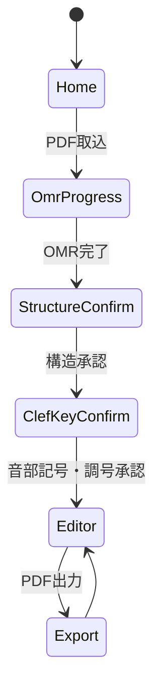

# プロジェクト用語集 (Glossary)

## 概要

このドキュメントは、プロジェクト内で使用される用語の定義を管理します。コード内の識別子は本用語集の英語表記に統一します（[開発ガイドライン](development-guidelines.md)参照）。

**更新日**: 2026-07-30

**UIに出す文字列そのものはこの用語集で管理しない**。文言は今後も磨き続けるため、用語集と二重管理すると必ずズレる（下記「オクターブ下ト音記号」の英語表記が実装と食い違っていたのがその実例）。用語集が持つのは「なぜその呼び方をするか」という方針・根拠と、音楽用語としての定義であり、表示文字列の正は表示名モジュール（`src/renderer/labels/scoreLabels.ts`）に置く。

## ドメイン用語（音楽）

### 移動ド（階名唱）

**定義**: 調の主音（または基準音）を「ド」（短調では「ラ」）として、音を調との相対関係で読む読み方

**説明**: 固定ド（音名 C を常にドと読む）と対をなす。相対音感による視唱と楽曲理解に適し、合唱演奏上有利とされる。本プロダクトの中核概念

**関連用語**: 階名、La基準/Do基準、固定ド

**英語表記**: movable do / solfa

### 階名

**定義**: 移動ドにおける各音の呼び名（do, re, mi, ...）。調が決まると音高から一意に決まる

**説明**: 本プロジェクトの内部表現は文字列ではなく「度数＋変位」（→ SolfaDegree）で持ち、表示時に音節体系に応じて文字列化する

**英語表記**: solfa（コード内の識別子）。表示文字列は syllable

### La基準 / Do基準

**定義**: 短調の階名の振り方の流儀。La基準は平行長調のドを維持し主音を「ラ」と読む（コダーイ／Tonic sol-fa の伝統）。Do基準は短調の主音を常に「ド」と読む（me/le/te を使う）

**説明**: イ短調の主和音 A–C–E は、La基準で「ラ・ド・ミ」、Do基準で「ド・メ・ソ」。この選択で短調パッセージの階名は全音変わる。本アプリのデフォルトは **La基準**

**英語表記**: la-based minor / do-based minor（コード内: `minorBasis: 'la' | 'do'`）

### 音節体系

**定義**: 階名（度数＋変位）を表示文字列にする際の体系。本アプリは**コダーイ式**（do, di, re, me 等）をデフォルトとし、**Tonic sol-fa 略記**（d, r, m ＋ de, ta 等）に切替できる

**説明**: 短調基準（La/Do）とは直交する軸であり、内部表現から独立に切替できる（PRD F-3）

**英語表記**: syllable system（コード内: `syllableSystem: 'kodaly' | 'tonicSolfa'`）

### 幹音 / 半音変化

**定義**: 幹音＝現在の調のダイアトニック音（変位0）。半音変化＝臨時記号等により半音上下した音（変位±1）

**説明**: 出力PDFでは色・書体で区別する（幹音=濃赤、変化音=紫がデフォルト）

**英語表記**: diatonic / chromatic alteration（コード内: `alteration`）

### 調号 / 臨時記号 / 音部記号

**定義**: 調号＝曲・段の頭で調を示す♯♭群。臨時記号＝小節内で一時的に音を変化させる記号。音部記号＝譜表の音高基準を定める記号（ト音記号等）

**説明**: 階名付与に必要な認識対象はこの3つ＋音高のみ。系統的誤り（音部記号・調号の誤認識）は段全体を全滅させるため、確認画面（F-2）で人間が検証する

**英語表記**: key signature / accidental / clef

### オクターブ下ト音記号

**定義**: 通常のト音記号より1オクターブ低く読む記号（記号下に小さな「8」）。合唱のテノールパートで標準的に使われる

**説明**: OMRの鬼門であり、通常のト音記号と誤認されると段全体の階名が1オクターブ（実質的には全部）ずれる。確認画面の最重要チェック項目

**英語表記**: octave-down treble clef（Audiveris の clef kind: `TREBLE_DOWN_8`、UI表示: 「オクターヴ下ト音記号」）

### 転調 / 転調点

**定義**: 曲の途中で調が変わること。転調点はその位置（小節・拍）

**説明**: 調号変更を伴う転調は自動検出できるが、調号が変わらない一時転調や読み替え点は歌い手の解釈であり、ユーザーが指定・修正する（F-6、差別化ポイント）

**関連用語**: KeyRegion（調文脈）

**英語表記**: modulation / modulation point

### 平行調 / 平行長調

**定義**: 平行調＝同じ調号を持つ長調と短調の組（例: ハ長調とイ短調）。平行長調＝短調から見た平行調の長調側（イ短調にとってのハ長調）

**説明**: La基準短調では「do」が平行長調の主音に置かれる（主音の短3度上）。他ドキュメントでは主に「平行長調の主音」の形で登場する

**英語表記**: relative key / relative major

### 和音役割

**定義**: ある音が和音の中で担う役割（根音・第三音・第五音・第七音・第九音等）

**説明**: 和音の内部構造だけで決まり、調にも階名設定にも依存しない。合唱では「根音はしっかり、第三音は控えめに」等の歌い分けに直結する。v2 の独立レイヤーとして提供予定（F-7）

**英語表記**: chord role（コード内: `layer: 'chordRole'`）

### 非和声音

**定義**: 和音構成音以外の音（経過音・掛留・倚音など）

**説明**: その判定は完全なルールベースでは解けない研究レベルの問題。v2 の和音役割表示では、確信度が低い箇所は表示を控える／「?」を付ける設計とする

**英語表記**: non-chord tone

### インチピット

**定義**: 楽譜の左端に置かれる、原典の記譜法（古い音部記号等）を示す小さな譜表

**説明**: プロトタイプ検証で、インチピットが原因で第1システムが独立譜表に誤分割される系統的エラーが実際に発生した。構造確認画面（StructureConfirm）で復元する

**英語表記**: incipit

### システム（段）/ 譜表 / 小節

**定義**: システム＝ページ内で同時に演奏される譜表のまとまり（合唱では SATB 4段等）。譜表＝五線1組。小節＝拍子で区切られた単位

**説明**: UI ではシステムを一貫して「段」と表示する（練習現場の「2段目の4小節目から」という言い方に合わせる。指揮者の号令の語彙がそのまま使える）。「システム」という語は UI に出さない。
「譜表」も UI には出さず「パート」と表示する（→ パート）

**英語表記**: system / staff / measure

### パート

**定義**: 1本の旋律線を担当する声部。合唱団員の日常語では「同じ譜面上の1本の線を共有して歌う人の集団」を指す（例:「テノールパート」）

**説明**: MusicXML の `<part>` ＝ ScoreModel の `Part` に対応し、`partId`（P1, P2, …）で識別する。
v1 の対象である合唱の開離譜では「日常語のパート」「MusicXML の part」「譜表」の三者が一致するため、UI では一貫して「パート」と表示し、「譜表」という語は出さない。
UI 上は `partId` も見せず「上から N 番目のパート」と呼ぶ。「1段目〜4段目」とは書かない（本用語集の「段」はシステムを指すため衝突する）。

一致が崩れる例（v1 ではスコープ外）:

- 賛美歌等の 2 段譜: 1 譜表に 2 パート（上段に S+A）
- ピアノ伴奏: 1 パートに 2 譜表（大譜表）
- divisi: 日常語の「テノール」が 1 譜表上の 2 声部を総称する

将来これらを扱う際、モデル側は `Part`（論理）と `StaffRef`（物理）を既に分けているため破綻しないが、UI 用語はこの前提の見直しが必要になる。

**関連用語**: システム（段）/ 譜表 / 小節、SATB、確認項目（ConfirmationItem）

**英語表記**: part（コード内: `Part` / `partId`。物理的な五線は `StaffRef`）

## プロジェクト固有用語

### オーバーレイ方式

**定義**: 楽譜を再組版せず、元PDFの版面そのものに階名を重ね書きして出力する方式

**説明**: 練習現場で重要な「みんなと同じ版・同じページ割・練習番号」を保つ、本プロダクト最大の差別化ポイント。対義: 再組版（MusicXMLからの再レンダリング。スコープ外）

**英語表記**: overlay

### ローカル完結

**定義**: 楽譜由来のデータ（PDF・中間データ・注釈）を外部サーバーに一切保存・送信しない設計方針

**説明**: 著作権対応の中核。実装・依存追加・レビューのすべてで遵守する（開発ガイドラインの最優先ブロッカー）

**英語表記**: local-only

### 確認画面

**定義**: 階名生成の前に、検出された譜表構造（StructureConfirm）と音部記号・調号（ClefKeyConfirm）をユーザーが検証・修正する画面

**説明**: 系統的エラーを少数の確認でほぼ全て捕捉する、安くて効果の大きいUI。承認（`completedAt`）が階名生成のゲート。
承認後に訂正を入れると承認は取り消される（未確認の内容が承認済みとして出力されないようにするため）

**英語表記**: confirmation screen（コード内: `ConfirmationState`）

### 確認項目（ConfirmationItem）

**定義**: ClefKeyConfirm の音部記号表の 1 行。**1 パートにつき 1 行ではなく、(パート, 検出音部記号) のグループ**を表す

**説明**: 実データの誤検出はパート単位で系統的に起きる（divisi の P6 は 35 段が一括で ALTO 誤検出）ため、
グループに畳んでも訂正能力を失わない。実測で Victoria 36 譜表 → 5 行 / divisi 288 譜表 → 17 行となり、
「1曲5分以内」（PRD F-2）はこの集約なしには満たせない。1 行の訂正は `staffRefs` の全譜表へ適用される
（UI ではこの範囲を「全 N 段のうち M 段」と表示する）。
並び順は楽譜順（`partId` の自然順 → 検出値昇順）に固定する。合唱団員のメンタルモデルは
「上に高い声部、下に低い声部」であり、不一致件数の降順に並べると**初回解析時にたまたま不一致が出たか
どうかで並びの意味が変わって**しまうため。不一致のある行はバッジとサマリ文で見つけさせる。
調号は譜表ではなく小節区間の性質のため確認項目には含めない（`KeyRegionDecision` が担当）

**英語表記**: confirmation item（コード内: `ConfirmationItem`）

### ユーザー判断（decision）

**定義**: 確認画面でユーザーが下した訂正の記録。`StructureDecision`（段の小節数・楽章の割当）と
`KeyRegionDecision`（旋法・調号）、および `ConfirmationItem.corrected`（音部記号）の 3 種

**説明**: プロジェクトの**正はこの判断側**にあり、`score` / `keyRegions` は解析結果のキャッシュにすぎない。
同梱した OMR 成果物と判断があれば解析を再現できるため、認識ロジックを改善しても
保存済みプロジェクトのユーザー判断は生き続ける（信頼性要件「修正作業の永続化」）。
適用先が見つからない判断は例外にせず「適用されなかった訂正」として報告する
（黙って無視すると「訂正したのに反映されない」が無言で起きる）

**英語表記**: decision（コード内: `StructureDecision` / `KeyRegionDecision`）

### スキップ小節

**定義**: MusicXML と .omr の音符数が一致せず、照合をスキップした小節。階名が欠落した状態で残る

**説明**: 局所エラーを小節単位に閉じ込める設計の帰結。修正UI（Editor）の一覧からジャンプして人間が補う（プロトタイプ実測: 約296パート小節中5小節）

**英語表記**: skipped measure（コード内: `Measure.status: 'skipped'`）

### 注釈レイヤー

**定義**: 楽譜認識結果から分離して永続化される、出力PDFに描画する注釈（階名・和音役割）の集合

**説明**: OMR再実行や設定変更でも手動修正が生き残る設計の要。自動生成（origin: auto）と手動（origin: manual）を区別する

**英語表記**: annotation layer（コード内: `Annotation`）

### 度数＋変位（SolfaDegree）

**定義**: 階名の内部表現。現在の「do」を1とするダイアトニック度数（1〜7）と、半音変位（通常 -1/0/+1、重変化で ±2）の組

**説明**: 音節体系×短調基準の2軸を直交させるための表現。文字列化は表示時に syllableTables で行う

**英語表記**: `SolfaDegree { degree, alteration }`

### 照合（小節照合）

**定義**: MusicXML の音符列（論理）と .omr の符頭座標列（物理）をパート×小節単位で突き合わせ、対にする処理

**説明**: 一致した小節では音高のクロスチェック（譜表位置＋音部記号からの逆算 × MusicXML音名）も行う。ScoreModelBuilder が担当

**英語表記**: matching

### プロジェクト（Project）

**定義**: 1曲分の作業状態を表すルートエンティティ。楽譜モデル（ScoreModel）・調文脈（KeyRegion）・注釈（Annotation）・確認状態（ConfirmationState）・設定（ProjectSettings）を束ねる

**説明**: project.json としてプロジェクトファイル（.solfaproj）に永続化される。`schemaVersion` で互換性を判定する

**英語表記**: `Project`

### 楽譜モデル（ScoreModel）

**定義**: 照合済み楽譜の論理＋物理モデル。パート・システム（段）・小節から成り、各音符（NoteEvent）は MusicXML 由来の音高と .omr 由来の符頭座標を併せ持つ

**説明**: ScoreModelBuilder が構築し、階名計算（SolfaEngine）と注釈生成の入力となる。OMR未実行の間は null

**英語表記**: `ScoreModel`

### プロジェクトファイル（.solfaproj）

**定義**: 1曲分の作業状態を格納する zip 形式ファイル（project.json ＋ source.pdf ＋ omr/）

**説明**: 楽譜由来データをこの中に閉じ込める。保存ごとに .bak 3世代のバックアップを保持

**英語表記**: project file

## アーキテクチャ・コンポーネント

### 4層構成（UI / 編成 / サービス / データレイヤー）

**定義**: 本アプリの層分割。UIレイヤー（Renderer: 画面表示・入力受付）、編成レイヤー（Main: IPC受付・委譲・OMR実行制御）、サービスレイヤー（Main: ドメインロジック。Electron 非依存の純粋TS）、データレイヤー（Main: 永続化）の4層

**説明**: 依存方向は「UI→編成→サービス」「編成→データ」のみ許可。サービス→データは禁止（永続化は編成レイヤーが仲介する）。ディレクトリ対応は UI=`src/renderer/`、編成=`src/main/`、サービス=`src/domain/`、データ=`src/storage/`。詳細は[アーキテクチャ設計書](architecture.md)参照

### OmrRunner

**定義**: 同梱 Audiveris をヘッドレス子プロセスとして実行し、MusicXML・.omr・book.xml を取得するコンポーネント（進捗通知・キャンセル対応。F-1）

**所属**: 編成レイヤー（`src/main/omr/OmrRunner.ts`）

**関連用語**: Audiveris、OMR

### BookStructureResolver

**定義**: book.xml・sheet XML と MusicXML の段レイアウトを突き合わせて譜表構造の問題を検出し、**段ごとの通し小節番号を確定させた**構造（`ResolvedStructure`）を出力するコンポーネント

**所属**: サービスレイヤー（`src/domain/score/BookStructureResolver.ts`）

**補足**: 段の小節番号を構造側で確定させることで、Audiveris の段検出のブレ（ある段だけ stack が 1 つ多い等）が以降の全小節へ波及するのを防ぐ。誤分割そのものの自動統合は行わず、`StructureIssue` として確認画面に報告する

**関連用語**: インチピット、確認画面（StructureConfirm）、ScoreModelBuilder

### ScoreModelBuilder

**定義**: MusicXML（論理）と .omr（座標）をパート×小節単位で照合し、楽譜モデル（ScoreModel）を構築するコンポーネント。不一致小節は skipped として隔離し、音高のクロスチェックも行う

**所属**: サービスレイヤー（`src/domain/score/ScoreModelBuilder.ts`）

**関連用語**: 照合（小節照合）、スキップ小節、楽譜モデル（ScoreModel）

### SolfaEngine

**定義**: 調文脈（KeyRegion）から各音符の度数＋変位（SolfaDegree）を計算し、設定（音節体系×短調基準）に応じた表示文字列を導出するコンポーネント

**所属**: サービスレイヤー（`src/domain/solfa/SolfaEngine.ts`）

**関連用語**: 階名計算、度数＋変位（SolfaDegree）、音節体系

### KeyRegionBuilder

**定義**: MusicXML の調号宣言から調文脈（KeyRegion）を自動生成するコンポーネント。パートごとに調号を持続計算し、小節単位の多数決で 1 つに決める

**所属**: サービスレイヤー（`src/domain/solfa/KeyRegionBuilder.ts`）

**説明**: ScoreModelBuilder と同じ入力（OmrArtifacts + ResolvedStructure）を取り、同じ基準で通し小節番号へ変換するため、照合結果と調文脈の小節番号が必ず揃う。Audiveris は `<mode>` を出力しないため、生成される調文脈は全て長調になる（長短の指定は ClefKeyConfirm の担当）

**関連用語**: 調文脈（KeyRegion）、SolfaEngine、確定構造（ResolvedStructure）

### AnnotationManager

**定義**: 注釈レイヤーを管理するコンポーネント。階名計算結果からの自動生成（衝突回避配置を含む）、手動注釈の追加・編集・削除、再計算時の手動修正の保全を担う

**所属**: サービスレイヤー（`src/domain/annotations/AnnotationManager.ts`）

**関連用語**: 注釈レイヤー、衝突回避配置

### OverlayRenderer

**定義**: 元PDFの版面を変えずに注釈を重ね書きしたPDFのバイト列を生成するコンポーネント（.omr px→PDF pt の座標変換を含む）。ファイルへの書き込みは行わない（writeExportPdf が担当）

**所属**: サービスレイヤー（`src/domain/render/OverlayRenderer.ts`）

**関連用語**: オーバーレイ方式

### ProjectStore

**定義**: プロジェクトファイル（.solfaproj）の保存・読込・自動保存・世代バックアップを担うコンポーネント

**所属**: データレイヤー（`src/storage/ProjectStore.ts`）

**関連用語**: プロジェクトファイル（.solfaproj）

### writeExportPdf

**定義**: OverlayRenderer が生成した注釈付きPDFのバイト列を、ユーザー指定パスへ原子的に書き出す関数（一時ファイルに書いてからリネームし、不完全なPDFを残さない）

**所属**: データレイヤー（`src/storage/writeExportPdf.ts`）

## 技術用語

### Audiveris

**定義**: OSS の OMR（光学的楽譜認識）エンジン（Java製）

**公式サイト**: https://audiveris.org/

**本プロジェクトでの用途**: スキャンPDFから MusicXML（論理情報）と .omr（記号座標）を得る。同梱JREでヘッドレス子プロセスとして実行

**バージョン**: 5.x（完全固定。更新は回帰手順必須）

### .omr ファイル

**定義**: Audiveris が MusicXML とは別に出力するファイル。段ごとの sheet XML を含む zip で、認識した各記号の元画像上のピクセル座標（300dpi基準）を持つ

**本プロジェクトでの用途**: オーバーレイの描画位置の座標源。符頭 pitch は「中線=0・下向き正」

### MusicXML

**定義**: 楽譜の論理構造（音高・音価・調号等）を表す標準XML形式

**本プロジェクトでの用途**: 階名計算の解析対象。`part id` が book.xml の logical-id と対応し、譜表→パートの対応付けに使う

### book.xml

**定義**: Audiveris の .omr 内にあるブック構造ファイル。movement 分割・譜表構造の情報を持つ

**本プロジェクトでの用途**: インチピット等による譜表構造の誤分割の検出・復元（BookStructureResolver）

### music21

**定義**: MIT製の音楽解析 Python ライブラリ（調検出・chordify・ローマ数字和声解析）

**公式サイト**: https://music21.org/

**本プロジェクトでの用途**: v1 では不使用（解析は自前TSで足りることをプロトタイプで実証済み）。v2 の和音解析で導入を再検討

### Electron / Main・Renderer プロセス

**定義**: Web技術でデスクトップアプリを作る基盤。Main（Node.js側: プロセス制御・ファイルIO）と Renderer（画面側: サンドボックス化）の2プロセス構成

**本プロジェクトでの用途**: アプリ基盤。Renderer は preload（contextBridge）経由の型付きIPCのみで Main と通信する

### PDF.js / pdf-lib

**定義**: PDF.js＝Mozilla製のPDFレンダリングライブラリ。pdf-lib＝PDFの生成・編集ライブラリ

**本プロジェクトでの用途**: PDF.js は画面上の楽譜表示（Editor）。pdf-lib は元PDFへの注釈描画出力（再エンコードなし＝版面維持）

### Zod / fflate / Vitest / Playwright

**定義**: Zod＝スキーマ検証、fflate＝zip読み書き、Vitest＝テストフレームワーク、Playwright＝E2Eテストツール

**本プロジェクトでの用途**: project.json の検証 / .omr・.solfaproj の読み書き / ユニット・統合テスト / Electron のE2Eテスト

## 略語・頭字語

### OMR

**正式名称**: Optical Music Recognition（光学的楽譜認識）

**意味**: 楽譜画像から音楽情報（音高・リズム・記号）を認識する技術

**本プロジェクトでの使用**: パイプラインの第1段（Audiveris）。総合精度80〜90%だが、階名付与に必要な音高系の実効精度はそれより高い（プロトタイプで実証）

### SATB

**正式名称**: Soprano, Alto, Tenor, Bass

**意味**: 混声四部合唱の標準パート構成

**本プロジェクトでの使用**: 想定する典型的な入力楽譜の構成

### PRD / MVP

**正式名称**: Product Requirements Document / Minimum Viable Product

**意味**: プロダクト要求定義書 / 実用最小限の製品

**本プロジェクトでの使用**: [docs/product-requirements.md](product-requirements.md) / v1のP0機能群（F-1〜F-5）

### IPC

**正式名称**: Inter-Process Communication

**意味**: プロセス間通信

**本プロジェクトでの使用**: Renderer↔Main の通信。チャネル名とペイロード型は `src/shared/ipc/` で共有

### JRE

**正式名称**: Java Runtime Environment

**意味**: Javaの実行環境

**本プロジェクトでの使用**: Audiveris 実行用にアプリへ同梱（ユーザーのJavaインストール不要）

### E2E

**正式名称**: End-to-End

**意味**: ユーザー操作の始点から終点までを通すテスト

**本プロジェクトでの使用**: Playwright による「新規プロジェクト→確認→修正→出力」等のシナリオテスト

## ステータス・状態

### 小節の照合状態（Measure.status）

| ステータス | 意味                                       | 遷移条件             | 次の状態                           |
| ---------- | ------------------------------------------ | -------------------- | ---------------------------------- |
| matched    | MusicXMLと.omrの音符が対になり階名付与可能 | 音符数一致＋照合成功 | （終端）                           |
| skipped    | 照合をスキップし階名が欠落                 | 音符数不一致         | 手動修正により実質解消（注釈追加） |

### 音部記号の確認状態（ClefKeyConfirm の各行）

| 状態     | 条件                                                                                          | 意味                                                                                                                                                                                                                     |
| -------- | --------------------------------------------------------------------------------------------- | ------------------------------------------------------------------------------------------------------------------------------------------------------------------------------------------------------------------------ |
| 確認済み | 検出値あり ＋ `mismatchCount` = 0                                                             | クロスチェックを行い、食い違いが無かった                                                                                                                                                                                 |
| 要確認   | 検出値あり ＋ `mismatchCount` > 0                                                             | 音部記号を誤検出している可能性が高い                                                                                                                                                                                     |
| 未検査   | 検出値が `UNKNOWN`（Audiveris が音部記号を記録しなかった）、または中線が定義されていない kind | **クロスチェック自体が行われていない**。`mismatchCount` が 0 でも「問題なし」を意味しない（`headStepOctave` は `clefKind` が `null` のときも、`clefTable` に中線の無い kind のときも `null` を返して検算をスキップする） |
| 訂正済み | `corrected` が設定されている                                                                  | ユーザーが判断を下した。訂正値で `staff.clefKind` が上書きされ、未検査だった譜表もクロスチェックの対象になる                                                                                                             |

未検査は「確認が必要な件数」に算入する（0 件を「問題なし」として見せないため）。訂正済みは算入しない。

### 注釈の由来（Annotation.origin）

| 値     | 意味                                                                       |
| ------ | -------------------------------------------------------------------------- |
| auto   | 階名計算から自動生成。再生成で更新される。`deleted` フラグで非表示化できる |
| manual | ユーザーが追加。再生成・再計算でも保全される                               |

### 調文脈の由来（KeyRegion.source）

| 値   | 意味                                                                                                                                                                                                                                                |
| ---- | --------------------------------------------------------------------------------------------------------------------------------------------------------------------------------------------------------------------------------------------------- |
| auto | 調号（変更）から自動検出（KeyRegionBuilder が生成）。曲頭に調号宣言がない場合はハ長調を既定として置く                                                                                                                                               |
| user | ユーザーが指定（ClefKeyConfirm の旋法指定、および F-6 の転調点指定）。auto を上書きできる。**長短（mode）の指定は user のみ**（Audiveris が `<mode>` を出力しないため auto は常に長調になる）。旋法だけを訂正した場合は調号を保ったまま平行調へ移る |

### 画面遷移



## エラー・例外

### OMR実行エラー

**クラス名**: `OmrExecutionError`

**発生条件**: Audiveris 子プロセスの異常終了

**対処方法**: ログ（`logPath`）を保全してユーザーに提示。一部ページのみの失敗なら成功ページで続行（部分失敗の原則）

### プロジェクトファイルエラー

**クラス名**: `ProjectFileError`

**発生条件**: .solfaproj の zip 破損（cause: 'zip'）、project.json のスキーマ不一致（'schema'）、アプリより新しい schemaVersion（'version'）、入出力失敗（'io'）

**対処方法**: 読込は安全に失敗させ、.bak 世代からの復元を案内する。'version' の場合はファイルを変更せず、アプリの更新を案内する

## 計算・アルゴリズム

### 階名計算

**定義**: 調文脈（KeyRegion）と記譜音高から度数＋変位を求める計算

**計算式**:

```
do の位置 = 主音（major または do基準） / 平行長調の主音（minor × la基準）
degree     = ((stepIndex(note) - stepIndex(do) + 7) % 7) + 1
alteration = note.alter - expectedAlterInDoMajor(do, degree)
             ※ 期待変位は「doの半音位置＋長音階オフセット」と当該幹音の半音位置の差。
               導出手順は機能設計書「階名計算」ステップ3を参照
```

**実装箇所**: `src/domain/solfa/SolfaEngine.ts`

**例**:

```
入力: do=G、音=F♮
出力: { degree: 7, alteration: -1 } → コダーイ式 "te"（Tonic sol-fa略記では "ta"）
```

### 小節照合

**定義**: パート×小節ごとに MusicXML の発音音符数と .omr の符頭数を比較し、一致時のみ対にする。不一致は skipped として隔離

**実装箇所**: `src/domain/score/ScoreModelBuilder.ts`

### 衝突回避配置

**定義**: 階名注釈の描画位置を、近傍記号のバウンディングボックスおよび先に置いた注釈と交差しない候補位置（直上→さらに上→直下→さらに下→左右斜め上→2段上下→左右斜め下の 10 段）から選ぶ処理

**説明**: **符幹（stem）と加線（ledger）は障害物に含めない**。幅数pxの細い線で階名文字が重なっても判読を妨げず、含めると実データで配置品質が大きく落ちるため（実測: 符頭直上をそのまま使えた割合が Victoria 43.2% → 89.2%、divisi 21.6% → 61.1%）。どの候補も空かない場合は基本位置に置き、`placementUnresolved` として報告して人手の調整に委ねる

**実装箇所**: `src/domain/annotations/placementResolver.ts`

**関連用語**: 注釈レイヤー、AnnotationManager
